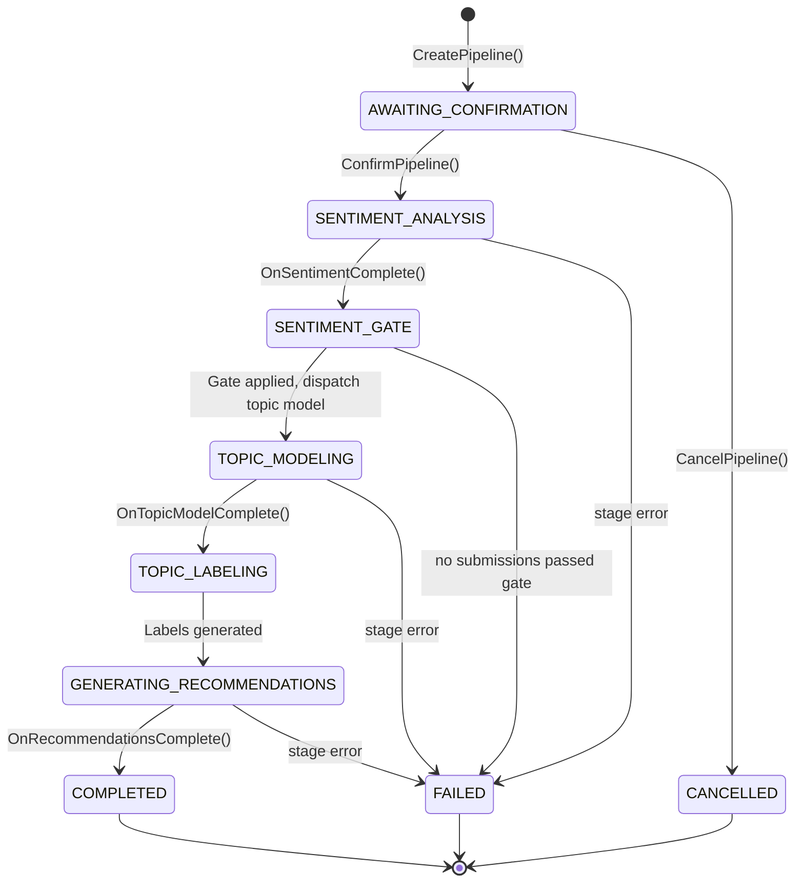

> **Status:** Implemented (FAC-46) — Pipeline orchestrator, all four processors, and REST controller are live.

## 1. Architecture: NestJS Orchestrator + HTTP Workers

```
┌──────────────────────┐         ┌─────────────┐         ┌──────────────────┐
│  NestJS API          │────────▶│   BullMQ    │────────▶│  Batch Processors│
│  - Controller        │         │  (Redis)    │         │  - Sentiment     │
│  - Orchestrator      │         │             │         │  - Topic Model   │
│  - AnalysisService   │         │  sentiment  │         │  - Recommendations│
│                      │         │  embedding  │         │  - Embedding     │
│  writes to           │◀────────│  topic-model│         └────────┬─────────┘
│  database            │ results │  recommend. │                  │ HTTP POST
└──────────────────────┘         └─────────────┘                  ▼
                                                       ┌──────────────────┐
                                                       │  External Workers │
                                                       │  (HTTP endpoints) │
                                                       │  - RunPod (GPU)   │
                                                       │  - LLM APIs       │
                                                       │  - Mock Worker    │
                                                       └──────────────────┘
```

**Key principle:** Workers are **pure compute** HTTP endpoints — they receive JSON input via POST, return JSON results. NestJS owns all database access, business logic, queuing, and retry logic. Workers never touch the database.

## 2. Pipeline Lifecycle

The pipeline follows a **confirm-before-execute** pattern with sequential stage progression:



### Stage Details

| Stage                  | Input                                     | Output                                                                      |
| ---------------------- | ----------------------------------------- | --------------------------------------------------------------------------- |
| **Create**             | Scope filters (semester, faculty, etc.)   | Coverage stats, warnings, `AnalysisPipeline` entity                         |
| **Confirm**            | Pipeline ID                               | Embedding backfill (best-effort), sentiment dispatch                        |
| **Sentiment Analysis** | Batch of comments                         | Per-submission sentiment scores                                             |
| **Sentiment Gate**     | Sentiment results                         | Filtered corpus (negative/neutral always pass; positive needs ≥10 words)    |
| **Topic Modeling**     | Gate-passing submissions + embeddings     | Topics, keyword clusters, soft assignments                                  |
| **Topic Labeling**     | Topics with raw labels + keywords         | Human-readable labels (2-4 words) via LLM                                   |
| **Recommendations**    | Pipeline ID (all data queried in-process) | STRENGTH/IMPROVEMENT actions with confidence scores and structured evidence |

### Coverage Warnings

The orchestrator generates warnings at pipeline creation when:

| Condition                  | Threshold  |
| -------------------------- | ---------- |
| Low response rate          | < 25%      |
| Insufficient submissions   | < 30       |
| Insufficient comments      | < 10       |
| Post-gate corpus too small | < 30       |
| Stale enrollment data      | > 24 hours |

## 3. Batch Message Contract

Pipeline-driven stages use a **batch envelope** (all items in one job):

```typescript
// Outbound: Orchestrator → BullMQ queue
BatchAnalysisJobMessage {
  jobId: string;        // UUID
  version: string;      // Contract version (e.g., "1.0")
  type: string;         // "sentiment" | "topic-model" | "recommendations"
  items: Array<{
    submissionId: string;
    text: string;
    embedding?: number[];  // topic-model only
  }>;
  metadata: {
    pipelineId: string;
    runId: string;
  };
  publishedAt: string;  // ISO 8601
}

// Inbound: Worker HTTP response → validated by processor
BatchAnalysisResultMessage {
  jobId?: string;       // Optional — workers don't echo this back
  version: string;
  status: "completed" | "failed";
  results?: Array<Record<string, unknown>>;  // Type-specific items
  error?: string;
  completedAt: string;  // ISO 8601 (accepts UTC 'Z' and timezone offsets)
}
```

The embedding processor uses the original single-item `AnalysisJobMessage` contract since it processes individual submissions independently.

Worker-specific response schemas are validated by each processor:

- Sentiment: `sentimentResultItemSchema` (positive/neutral/negative scores)
- Topic model: `topicModelWorkerResponseSchema` (topics + assignments + metrics)

The recommendations stage does **not** use the batch message contract — see [Recommendation Generation](#12-recommendation-generation) below.

See `docs/worker-contracts/` for full per-worker contracts.

### Dispatch-Set Pinning (LLM Workers)

Zod validates the **shape** of a worker response but cannot validate that the `submissionId` keys actually correspond to rows the API dispatched. For LLM-backed workers this matters: under some prompts the model hallucinates UUIDs that don't exist in the dispatched batch, and persisting them causes PostgreSQL FK violations that abort the whole batch transaction — losing even the valid results.

`SentimentProcessor.Persist()` pins the response against a dispatch set:

1. Build `dispatchedIds = new Set(job.data.items.map(i => i.submissionId))` before any DB work.
2. Drop every result whose `submissionId` is not in `dispatchedIds`. Log `warn "Dropped X of Y sentiment results for run {runId} (unknown submissionIds)"` whenever the drop count is non-zero.
3. If **all** results are dropped, call `orchestrator.OnStageFailed(pipelineId, 'sentiment_analysis', ...)` and return. Retry is not useful — more LLM calls will produce more hallucinations.
4. The pre-existing `sentimentResultItemSchema.safeParse` loop still runs on the filtered set as a second validation layer.

Treat any new LLM-backed processor under `BaseAnalysisProcessor` as needing the same pattern. See [Decision #41 — LLM-Backed Worker Dispatch-Set Pinning](/docs/decisions#41-llm-backed-worker-dispatch-set-pinning).

## 4. Sentiment Gate

Between sentiment analysis and topic modeling, a **sentiment gate** filters the corpus:

- **Negative/Neutral** comments always pass (they contain the most actionable feedback)
- **Positive** comments must have ≥ 10 words to pass (short "great!" responses add noise to topic modeling)
- Results are stored as `passedTopicGate` on `SentimentResult` via bulk `nativeUpdate`
- Gate statistics (`sentimentGateIncluded`, `sentimentGateExcluded`) are persisted on the pipeline

## 5. Queue Architecture

Four BullMQ queues with independent configuration:

| Queue             | Contract    | Concurrency | Purpose                          |
| ----------------- | ----------- | ----------- | -------------------------------- |
| `sentiment`       | Batch       | 3           | Sentiment classification         |
| `embedding`       | Single-item | 3           | Vector embedding generation      |
| `topic-model`     | Batch       | 1           | BERTopic topic discovery         |
| `recommendations` | Batch       | 1           | LLM-based action recommendations |

## 6. Redis Strategy

Single Redis instance for development/staging. In production, split into two:

| Instance    | Purpose                               | Eviction Policy | Persistence |
| ----------- | ------------------------------------- | --------------- | ----------- |
| Cache Redis | API response caching (`CacheService`) | `allkeys-lru`   | None        |
| Queue Redis | BullMQ job queues (analysis jobs)     | `noeviction`    | AOF/RDB     |

## 7. Environment Variables

| Variable                               | Default       | Description                                                                 |
| -------------------------------------- | ------------- | --------------------------------------------------------------------------- |
| `SENTIMENT_WORKER_URL`                 | —             | RunPod/mock URL for sentiment analysis                                      |
| `SENTIMENT_CHUNK_SIZE`                 | 50            | Submissions per sentiment chunk (see §14)                                   |
| `ALLOW_SENTIMENT_VLLM_ENABLED_IN_PROD` | `false`       | Production safety gate — required to enable vLLM dispatch in prod (see §15) |
| `EMBEDDINGS_WORKER_URL`                | —             | URL for embedding generation                                                |
| `TOPIC_MODEL_WORKER_URL`               | —             | URL for topic modeling                                                      |
| `RECOMMENDATIONS_WORKER_URL`           | —             | Deprecated — recommendations now use direct LLM                             |
| `RECOMMENDATIONS_MODEL`                | `gpt-4o-mini` | OpenAI model for recommendation generation                                  |
| `BULLMQ_SENTIMENT_CONCURRENCY`         | 3             | Sentiment processor concurrency                                             |
| `EMBEDDINGS_CONCURRENCY`               | 3             | Embedding processor concurrency                                             |
| `TOPIC_MODEL_CONCURRENCY`              | 1             | Topic model processor concurrency                                           |
| `RECOMMENDATIONS_CONCURRENCY`          | 1             | Recommendations processor concurrency                                       |
| `BULLMQ_DEFAULT_ATTEMPTS`              | 3             | Job retry attempts                                                          |
| `BULLMQ_DEFAULT_BACKOFF_MS`            | 5000          | Initial backoff delay                                                       |
| `BULLMQ_HTTP_TIMEOUT_MS`               | 90000         | HTTP request timeout (default)                                              |
| `BULLMQ_TOPIC_MODEL_HTTP_TIMEOUT_MS`   | 300000        | Topic model HTTP timeout (5 min)                                            |
| `BULLMQ_STALLED_INTERVAL_MS`           | 30000         | Stall detection interval                                                    |
| `BULLMQ_MAX_STALLED_COUNT`             | 2             | Max stalled retries before failure                                          |
| `RUNPOD_API_KEY`                       | —             | RunPod API key for serverless workers                                       |

## 8. Vector Storage

Embeddings are stored using **pgvector** on the existing PostgreSQL database:

- `SubmissionEmbedding` entity with `VectorType` column (768-dim, LaBSE model)
- Upsert behavior: existing embeddings are updated in place
- Used by topic modeling stage to provide pre-computed embeddings alongside text

## 9. Text Preprocessing

Raw `qualitativeComment` values are cleaned at submission time into a `cleanedComment` field. All downstream analysis stages (sentiment, embeddings, topic modeling) operate on `cleanedComment` rather than the raw text.

The `cleanText()` utility (`src/modules/questionnaires/utils/clean-text.ts`) applies:

| Step                         | Purpose                                                    |
| ---------------------------- | ---------------------------------------------------------- |
| Excel artifact removal       | Drops `#NAME?`, `#VALUE!`, etc. from imported spreadsheets |
| URL stripping                | Removes `http://` and `www.` links                         |
| Broken emoji removal         | Strips `U+FFFD` replacement characters                     |
| Laughter noise removal       | Strips `hahaha`, `lol`, `lmao`, etc.                       |
| Repeated character reduction | `gooood` → `god` (3+ → 1)                                  |
| Punctuation spam reduction   | `!!!` → `!`                                                |
| Keyboard mash detection      | Drops gibberish with < 15% vowel ratio                     |
| Minimum word count           | Drops entries with fewer than 3 words after cleaning       |

Returns `null` for entries that should be excluded from analysis entirely (gibberish, artifacts, too short).

## 10. RunPod Integration

Workers deployed on RunPod serverless use a specialized base class:

```
BaseBatchProcessor          ← HTTP dispatch, Zod validation, retry
  └── RunPodBatchProcessor  ← RunPod envelope handling
        └── TopicModelProcessor
```

`RunPodBatchProcessor` (`src/modules/analysis/processors/runpod-batch.processor.ts`) handles:

- **Auth header:** `Authorization: Bearer <RUNPOD_API_KEY>` (when configured)
- **Request wrapping:** `{ input: <job data> }` envelope for `/runsync`
- **Response unwrapping:** Extracts `body.output`, throws on `status: "FAILED"`
- **Async job polling:** When RunPod returns `IN_QUEUE` or `IN_PROGRESS` (i.e., the job exceeds the `/runsync` timeout), the processor automatically polls the `/status/{jobId}` endpoint every 5 seconds until the job completes, fails, or the processor's HTTP timeout is reached. The status URL is derived from the worker URL by replacing `/runsync` or `/run` with `/status/{id}`.

`BaseBatchProcessor` provides extension points for subclasses:

| Method                 | Default                          | Override Purpose                                    |
| ---------------------- | -------------------------------- | --------------------------------------------------- |
| `buildHeaders()`       | `Content-Type: application/json` | Add auth headers                                    |
| `wrapBody(data)`       | Pass-through                     | RunPod `{ input: ... }` wrapping                    |
| `unwrapResponse(body)` | Pass-through (async)             | RunPod `{ output: ... }` unwrapping + async polling |
| `getHttpTimeoutMs()`   | `BULLMQ_HTTP_TIMEOUT_MS`         | Per-processor timeout (topic model uses 300s)       |

## 11. Topic Labeling

After topic modeling completes and before recommendations are dispatched, the `TopicLabelService` generates human-readable labels for each discovered topic using an LLM (OpenAI `gpt-4o-mini`).

**How it works:**

1. The orchestrator fetches the latest `TopicModelRun` and its `Topic` entities.
2. `TopicLabelService.generateLabels()` sends all topics (raw labels + keywords) to the LLM in a single request.
3. The LLM returns short (2-4 word, title case) labels via structured output (`zodResponseFormat`).
4. Labels are written to the `Topic.label` field and flushed to the database.
5. Downstream consumers (recommendations, status endpoint) prefer `topic.label` over `topic.rawLabel`.

**Resilience:** If the LLM call fails (rate limit, network error, empty response), the service logs a warning and falls back silently — topics retain their BERTopic-generated `rawLabel`. This is a non-blocking, best-effort enrichment step.

## 12. Recommendation Generation

Unlike other pipeline stages that dispatch work to external HTTP workers, recommendations are generated **in-process** by `RecommendationGenerationService` calling the OpenAI API directly.

### Why Not an External Worker?

Recommendations don't need GPU compute — they're LLM text generation. The service also needs full database access to build rich prompts (dimension score aggregation, per-topic sentiment breakdowns, sample comment selection), which an external worker cannot do without replicating the data layer.

### Data Flow

```
BullMQ job (pipeline/run IDs only)
  → RecommendationsProcessor
    → RecommendationGenerationService.Generate(pipelineId)
      1. Load pipeline with scope relations
      2. Query dimension scores (SQL AVG aggregation on QuestionnaireAnswer)
      3. Load top 10 topics with per-topic sentiment breakdowns
      4. Select sample quotes (strongest sentiment signal from dominant topic assignments)
      5. Select proportional sample comments (distribution-aware across sentiment buckets)
      6. Build system + user prompt
      7. Call OpenAI with zodResponseFormat(llmRecommendationsResponseSchema)
      8. Attach supporting evidence with computed confidence levels
    → Persist RecommendedAction entities
    → Mark RecommendationRun COMPLETED
    → Advance pipeline to COMPLETED
```

### Prompt Structure

The LLM receives:

- **Context:** Submission count, comment count, response rate, global sentiment distribution
- **Topics:** Top topics with keywords, comment counts, and per-topic sentiment breakdowns
- **Dimension scores:** Average scores per questionnaire dimension
- **Sample comments:** Up to 20 comments, proportionally selected across sentiment labels

### Confidence Scoring

Each recommendation gets a computed confidence level based on its backing data:

| Level  | Criteria                                    |
| ------ | ------------------------------------------- |
| HIGH   | ≥ 10 comments AND ≥ 70% sentiment agreement |
| MEDIUM | ≥ 5 comments (or HIGH criteria not met)     |
| LOW    | < 5 comments                                |

When a recommendation references a topic, confidence is scoped to that topic's comment count and sentiment. Otherwise, pipeline-level totals are used as fallback.

### Supporting Evidence

Each `RecommendedAction` stores a `supportingEvidence` JSONB column with:

- **Sources:** Discriminated union of `TopicSource` (topic label, comment count, sentiment breakdown, sample quotes) and `DimensionScoresSource` (dimension code + average score pairs)
- **Confidence level:** HIGH / MEDIUM / LOW
- **basedOnSubmissions:** Total comment count in scope

> **Pipeline-scoped counts.** `TopicSource.commentCount` is derived from `TopicAssignment` rows filtered by **both** `topic.id IN (...)` and `submission.id IN (pipelineSubmissionIds)` — **not** from the `Topic.docCount` column. `Topic` is a shared entity: multiple pipelines across different faculty can produce assignments against the same topic, and `docCount` is a global counter over all of them. Scoping by `submissionIds` prevents cross-faculty evidence leakage and makes `confidenceLevel` reflect the current pipeline's evidence rather than the topic's global activity. Any future consumer of topic-derived evidence must apply the same scoping.

### Output Schema

Actions follow the `RecommendedActionItem` schema:

| Field                | Type                      | Description                                       |
| -------------------- | ------------------------- | ------------------------------------------------- |
| `category`           | `STRENGTH \| IMPROVEMENT` | Whether this is a positive finding or area to fix |
| `headline`           | string                    | Short title (5-10 words)                          |
| `description`        | string                    | 1-2 sentences explaining the observed pattern     |
| `actionPlan`         | string                    | 2-4 sentences with concrete steps                 |
| `priority`           | `HIGH \| MEDIUM \| LOW`   | Urgency level                                     |
| `supportingEvidence` | SupportingEvidence        | Structured evidence with confidence score         |

### Configuration

| Variable                | Default       | Description                    |
| ----------------------- | ------------- | ------------------------------ |
| `RECOMMENDATIONS_MODEL` | `gpt-4o-mini` | OpenAI model for generation    |
| `OPENAI_API_KEY`        | —             | Required (shared with ChatKit) |

## 13. Chunked Sentiment Dispatch

`PipelineOrchestratorService.dispatchSentiment()` splits in-scope submissions into N chunks of `SENTIMENT_CHUNK_SIZE` (default `50`) using `chunkSubmissionsForSentiment()` and enqueues one BullMQ job per chunk. Each chunk receives the same `BatchAnalysisJobMessage` envelope plus optional `metadata.chunkIndex` (0-based) and `metadata.chunkCount` (total chunks for the run). The envelope schema is `.strict()` — any drift fails validation at dispatch.

`SentimentRun` carries `expectedChunks` and `completedChunks` integer counters. Each chunk's `Persist()` runs in a single transaction:

1. Insert `SentimentResult` rows for the chunk's submissions.
2. `UPDATE sentiment_run SET completed_chunks = completed_chunks + 1`.
3. Read `(completedChunks, expectedChunks)`. When saturated, mark the run `COMPLETED` and call `OnSentimentComplete()`.

The transactional context is passed via `tx.getTransactionContext()` so the row inserts and the counter bump commit atomically — partial chunk failures retry per-chunk without rolling back peers.

If a chunk's BullMQ ack fails after commit, the retry hits the run's full unique index on `(run_id, submission_id)` (converted from a partial index in migration `20260417120000_sentiment-chunk-counters.ts`) and is treated as `duplicate-swallowed`. The processor re-reads the counter and re-fires `OnSentimentComplete()` only when the run is genuinely saturated, so completion is at-least-once but the downstream effect is idempotent.

For workflow detail and job log fields, see [Analysis Job Processing — Chunked Sentiment Dispatch](/docs/workflows/analysis-job-processing#chunked-sentiment-dispatch).

## 14. vLLM-Primary Sentiment Dispatch

The sentiment worker can route requests through a self-hosted vLLM model (primary) with the existing OpenAI path as fallback. The choice is runtime-configurable via a single `SystemConfig` row keyed `SENTIMENT_VLLM_CONFIG`:

```typescript
{
  url: string;
  model: string;
  enabled: boolean;
}
```

### Snapshot-once dispatch

`PipelineOrchestratorService.dispatchSentiment()` calls `SentimentConfigService.readConfig()` **once** per run, then attaches the resolved config to every chunk envelope as the optional `vllmConfig` field — but only when `enabled === true && url !== ''`. Reading once per dispatch (rather than per chunk) prevents a config flip mid-run from straddling the two paths and producing inconsistent `servedBy` provenance across the chunks of a single run.

The optional `servedBy: 'vllm' | 'openai'` field on each result item lets the worker tell the API which path actually served the request. The processor stores this in `SentimentResult.rawResult` JSONB for provenance — no schema change to the result table.

### Admin config endpoint

`AdminSentimentConfigController` (`/admin/sentiment/vllm-config`, SUPER_ADMIN only) exposes `GET` and `PUT`:

| Method | Path                           | Body                                 | Behavior                                                                   |
| ------ | ------------------------------ | ------------------------------------ | -------------------------------------------------------------------------- |
| GET    | `/admin/sentiment/vllm-config` | —                                    | Returns the current `{url, model, enabled}` (or defaults if unset)         |
| PUT    | `/admin/sentiment/vllm-config` | `{url?, model?, enabled?}` (partial) | Patches the row, validates, returns the post-write `{url, model, enabled}` |

Validation rules enforced by `SentimentConfigService.updateConfig()`:

- `url` must start with `https://` (SSRF mitigation against compromised admin sessions). Non-https values reject with 400 at the DTO layer.
- `enabled = true` with empty `url` or empty `model` rejects with 400.

The controller adds a production gate: when `NODE_ENV === 'production'` and `ALLOW_SENTIMENT_VLLM_ENABLED_IN_PROD !== true`, a `PUT` with `enabled: true` returns 400. Operators must set the env var explicitly to flip vLLM on in production.

`updateConfig()` returns `{previous, next}` from a single read, and the controller emits `admin.sentiment-vllm-config.update` with both sides as audit metadata. This avoids a TOCTOU window between a separate read and the write. See [Audit Trail — admin.sentiment-vllm-config.update](/docs/architecture/audit-trail#adminsentiment-vllm-configupdate).

## 15. Adding a New Analysis Type

1. Create `NewTypeProcessor extends BaseBatchProcessor` (or `RunPodBatchProcessor` for RunPod workers) in `src/modules/analysis/processors/`
2. Add `NEW_TYPE_WORKER_URL` and `NEW_TYPE_CONCURRENCY` to `src/configurations/env/bullmq.env.ts`
3. Register queue in `AnalysisModule`: add to `BullModule.registerQueue()`
4. Add `@InjectQueue('new-type')` to `PipelineOrchestratorService`
5. Add dispatch and completion methods in `PipelineOrchestratorService`
6. Update `PipelineStatus` enum with new stage
7. Add worker contract doc in `docs/worker-contracts/`
8. Add mock endpoint in `mock-worker/server.ts`

For **non-queue enrichment steps** (like topic labeling), create a service in `src/modules/analysis/services/`, register it in `AnalysisModule`, inject it into `PipelineOrchestratorService`, and call it inline during stage transitions.
