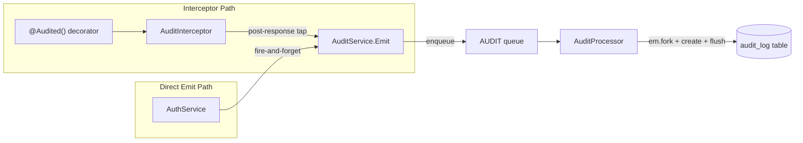

The `AuditModule` provides an append-only audit log for security-sensitive actions. It captures who did what, when, and from where — for compliance, incident investigation, and operational accountability.

## Architecture



### Two Emission Paths

| Path            | When                                                                                | Context Source                                                                 |
| --------------- | ----------------------------------------------------------------------------------- | ------------------------------------------------------------------------------ |
| **Interceptor** | Standard authenticated endpoints (logout, sync, submissions, pipelines)             | CLS (`CurrentUserService`, `RequestMetadataService`) with JWT payload fallback |
| **Direct emit** | Auth events where CLS context is unavailable (login success/failure, token refresh) | Explicit params from `AuthService`                                             |

Both paths feed the same `AuditService.Emit()` method, which enqueues a job to the `AUDIT` BullMQ queue.

## AuditLog Entity

Append-only, immutable. Does **not** extend `CustomBaseEntity` (no `updatedAt`, no `deletedAt`). Follows the `SyncLog` precedent.

| Column          | Type               | Notes                                                                                             |
| --------------- | ------------------ | ------------------------------------------------------------------------------------------------- |
| `id`            | `varchar` PK       | UUID v4, auto-generated                                                                           |
| `action`        | `varchar`          | Indexed. Dot-notation action code (e.g., `auth.login.success`)                                    |
| `actorId`       | `varchar` nullable | Indexed. Plain string, **not** a FK — survives user deletion                                      |
| `actorUsername` | `varchar` nullable | Denormalized for historical accuracy                                                              |
| `resourceType`  | `varchar` nullable | Entity name (e.g., `User`, `AnalysisPipeline`)                                                    |
| `resourceId`    | `varchar` nullable | UUID of affected resource                                                                         |
| `metadata`      | `jsonb` nullable   | Action-specific details (capped at 4KB from interceptor)                                          |
| `browserName`   | `varchar` nullable | From `MetaDataInterceptor` via CLS                                                                |
| `os`            | `varchar` nullable | From `MetaDataInterceptor` via CLS                                                                |
| `ipAddress`     | `varchar` nullable | From `x-forwarded-for` or socket                                                                  |
| `occurredAt`    | `timestamptz`      | Indexed. Set from job payload (event time, not processing time). DB default `now()` as safety net |

Queries must use `filters: { softDelete: false }` to bypass the global soft-delete filter.

## Action Codes

```typescript
export const AuditAction = {
  AUTH_LOGIN_SUCCESS: 'auth.login.success',
  AUTH_LOGIN_FAILURE: 'auth.login.failure',
  AUTH_LOGOUT: 'auth.logout',
  AUTH_TOKEN_REFRESH: 'auth.token.refresh',
  ADMIN_SYNC_TRIGGER: 'admin.sync.trigger',
  ADMIN_SYNC_SCHEDULE_UPDATE: 'admin.sync-schedule.update',
  ADMIN_SENTIMENT_VLLM_CONFIG_UPDATE: 'admin.sentiment-vllm-config.update',
  ADMIN_USER_SCOPE_UPDATE: 'admin.user.scope.update',
  ADMIN_USER_CREATE: 'admin.user.create',
  QUESTIONNAIRE_SUBMIT: 'questionnaire.submit',
  QUESTIONNAIRE_INGEST: 'questionnaire.ingest',
  QUESTIONNAIRE_SUBMISSIONS_WIPE: 'questionnaire.submissions.wipe',
  ANALYSIS_PIPELINE_CREATE: 'analysis.pipeline.create',
  ANALYSIS_PIPELINE_CONFIRM: 'analysis.pipeline.confirm',
  ANALYSIS_PIPELINE_CANCEL: 'analysis.pipeline.cancel',
  ANALYSIS_PIPELINE_FAIL: 'analysis.pipeline.fail',
  MOODLE_PROVISION_CATEGORIES: 'moodle.provision.categories',
  MOODLE_PROVISION_COURSES: 'moodle.provision.courses',
  MOODLE_PROVISION_QUICK_COURSE: 'moodle.provision.quick-course',
  MOODLE_PROVISION_USERS: 'moodle.provision.users',
  MOODLE_BULK_PROVISION_COURSES: 'moodle.provision.bulk-courses',
} as const;
```

The `moodle.provision.*` actions are emitted by the Moodle seeding toolkit — see [Moodle Provisioning](/docs/moodle/provisioning).

### `analysis.pipeline.fail`

Emitted directly from `PipelineOrchestratorService` (no `@Audited` decorator) on every terminal failure transition. Both `OnStageFailed()` and `failPipeline()` route through `emitPipelineFailAudit()`, which is guarded by `TERMINAL_STATUSES` so a race between the two paths cannot double-audit. The metadata payload captures operational context for post-mortem:

| Field          | Description                                                                                                                       |
| -------------- | --------------------------------------------------------------------------------------------------------------------------------- |
| `stage`        | Failing stage (`sentiment_analysis`, `topic_modeling`, `recommendations`, etc.)                                                   |
| `errorMessage` | Sanitized error string. `failPipeline()` parses the `"<stage>: <message>"` prefix when set.                                       |
| `trigger`      | `USER` or `SCHEDULER` — same value as `AnalysisPipeline.trigger`                                                                  |
| `coverage`     | `{ totalEnrolled, submissionCount, commentCount, responseRate }` snapshot at failure time                                         |
| `semesterId`   | UUID                                                                                                                              |
| `scope`        | FK ids snapshotted from the pipeline (`facultyId`, `departmentId`, `programId`, `campusId`, `courseId`, `questionnaireVersionId`) |

`actorId` is `pipeline.triggeredBy.id`; `resourceType = 'analysis_pipeline'`; `resourceId = pipeline.id`. Failures from scheduler-driven pipelines surface as `actorId = SUPER_ADMIN.id` with `metadata.trigger = 'SCHEDULER'`.

### `admin.sentiment-vllm-config.update`

Emitted directly from `AdminSentimentConfigController.UpdateConfig()` (not via the interceptor) so the metadata can carry both sides of the transition:

```typescript
metadata: {
  previous: {
    url: string;
    model: string;
    enabled: boolean;
  }
  next: {
    url: string;
    model: string;
    enabled: boolean;
  }
}
```

`SentimentConfigService.updateConfig()` returns `{previous, next}` from a single read so there is no TOCTOU window between an interceptor-side read and the service-side write. `resourceType = 'SystemConfig'`, `resourceId = 'SENTIMENT_VLLM_CONFIG'`. The handler does **not** apply `@Audited()` — using both paths would double-emit on every URL rotation.

## Interceptor Path Detail

Endpoints are tagged with the `@Audited({ action, resource? })` decorator, which sets Reflector metadata. The `AuditInterceptor` reads this metadata and, on successful response (RxJS `tap`, not `finalize`), enqueues an audit event.

Interceptor ordering matters: `MetaDataInterceptor` (IP/browser/OS) must run before `AuditInterceptor`. When `CurrentUserInterceptor` is present, it runs between them to populate the CLS user.

```typescript
@UseInterceptors(MetaDataInterceptor, CurrentUserInterceptor, AuditInterceptor)
```

The interceptor extracts `resourceId` from route params using a UUID v4 regex heuristic. Metadata captures route params and query params (not request body), capped at 4KB.

## Direct Emit Path Detail

Used in `AuthService` for login success, login failure, and token refresh. These events occur before JWT authentication is established, so CLS user context is unavailable.

- **Login success**: Emitted after the transaction returns, with `actorId`, `actorUsername`, and `strategyUsed` metadata.
- **Login failure**: Emitted after the transaction rejects, with `username` and a sanitized `reason` code (`no_matching_strategy` or `strategy_execution_failed`). Raw error messages are never persisted.
- **Token refresh**: Emitted after the transaction returns, with `actorId` and `actorUsername`.

All direct emits use `void this.auditService?.Emit(...)` — fire-and-forget, never inside a transaction.

## Queue & Processor

| Property           | Value                             |
| ------------------ | --------------------------------- |
| Queue name         | `audit`                           |
| Concurrency        | 1                                 |
| Retry attempts     | 1 (no retries)                    |
| `removeOnComplete` | `true`                            |
| `removeOnFail`     | 100 (keep last 100 for debugging) |

The `AuditProcessor` extends `WorkerHost` directly (no HTTP dispatch). It forks the `EntityManager`, creates an `AuditLog` entity, and flushes. The `@OnWorkerEvent('failed')` handler logs non-PII fields only (no `metadata`).

## Module Design

`AuditModule` is `@Global()` — the only application module using this decorator. This makes `AuditService` and `AuditInterceptor` injectable everywhere without explicit imports. Justified because audit is a cross-cutting concern consumed by many modules.

`AuditService` is injected with `@Optional()` in `AuthService` to avoid making audit a hard dependency of authentication. All `Emit()` calls use optional chaining.

## Error Handling

Audit failures never break the request:

1. `AuditService.Emit()` wraps `queue.add()` in try/catch — logs a warning, returns void.
2. `AuditInterceptor` wraps the entire `tap` callback in try/catch — errors are logged, never propagated.
3. The `.catch()` on the `Emit()` promise handles async rejections.

## Query API

`AuditController` exposes read-only query endpoints for operators. All routes require `SUPER_ADMIN` — any other role receives `403 Forbidden`.

| Method | Path              | Description                                      |
| ------ | ----------------- | ------------------------------------------------ |
| GET    | `/audit-logs`     | Paginated, filterable list of audit records      |
| GET    | `/audit-logs/:id` | Fetch a single record by UUID (`404` if missing) |

### List Filters (`ListAuditLogsQueryDto`)

| Field            | Match type                                                     | Notes                                              |
| ---------------- | -------------------------------------------------------------- | -------------------------------------------------- |
| `action`         | Exact                                                          | e.g., `auth.login.success`                         |
| `actorId`        | Exact (UUID)                                                   |                                                    |
| `actorUsername`  | Case-insensitive partial (`$ilike %value%`)                    | Trimmed; `%`, `_`, `\` are escaped before matching |
| `resourceType`   | Exact                                                          | e.g., `User`, `AnalysisPipeline`                   |
| `resourceId`     | Exact                                                          |                                                    |
| `from` / `to`    | Inclusive range on `occurredAt`                                | ISO 8601 date strings                              |
| `search`         | OR `$ilike` across `actorUsername` / `action` / `resourceType` | Same escape rules                                  |
| `page` / `limit` | Inherited from `PaginationQueryDto`                            | Defaults `page=1`, `limit=10`; `limit` max `100`   |

Explicit filters are combined with AND; `search` is always wrapped in its own `$or` so operators can express "admin login in January" by combining `search=login` with `from/to`.

### Ordering & Pagination

Results are ordered `occurredAt DESC, id DESC`. The secondary sort on `id` is load-bearing: audit writes land at sub-millisecond precision, so ordering by `occurredAt` alone would yield non-deterministic paging for bursty activity (logins, sync kickoff).

`findAndCount` is issued with `filters: { softDelete: false }` — belt-and-suspenders, since the entity does not extend `CustomBaseEntity` and cannot be soft-deleted today.

### Response Shapes

```ts
// GET /audit-logs
{
  data: AuditLogItemResponseDto[],
  meta: {
    totalItems: number,
    itemCount: number,
    itemsPerPage: number,
    totalPages: number,
    currentPage: number,
  },
}
```

`AuditLogItemResponseDto` and `AuditLogDetailResponseDto` currently share the same shape (`id`, `action`, `actorId?`, `actorUsername?`, `resourceType?`, `resourceId?`, `metadata?`, `browserName?`, `os?`, `ipAddress?`, `occurredAt`). They are kept as separate DTOs on purpose: the list view may later strip heavy fields (`metadata`, `ipAddress`) for bandwidth/privacy without breaking the single-record contract.

### LIKE-Pattern Escaping

User-supplied strings are trimmed and sanitized before being wrapped in `%…%`. `%`, `_`, and `\` are replaced with their backslash-escaped variants so that a username containing `%` cannot silently widen the match to every row.
