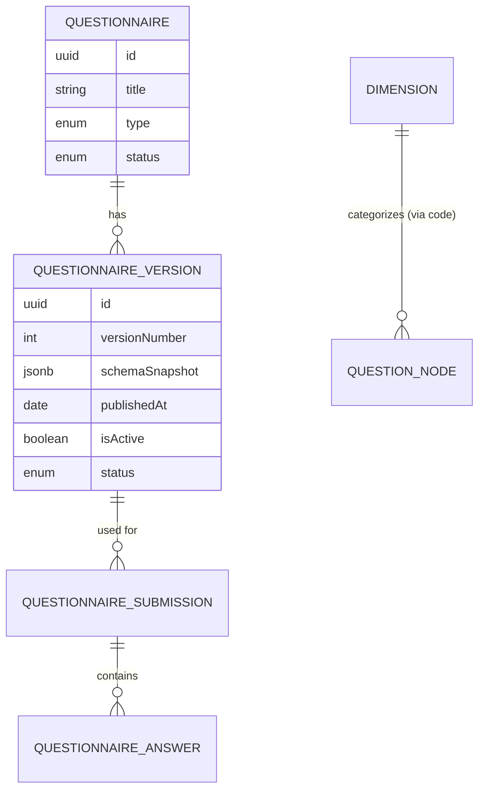
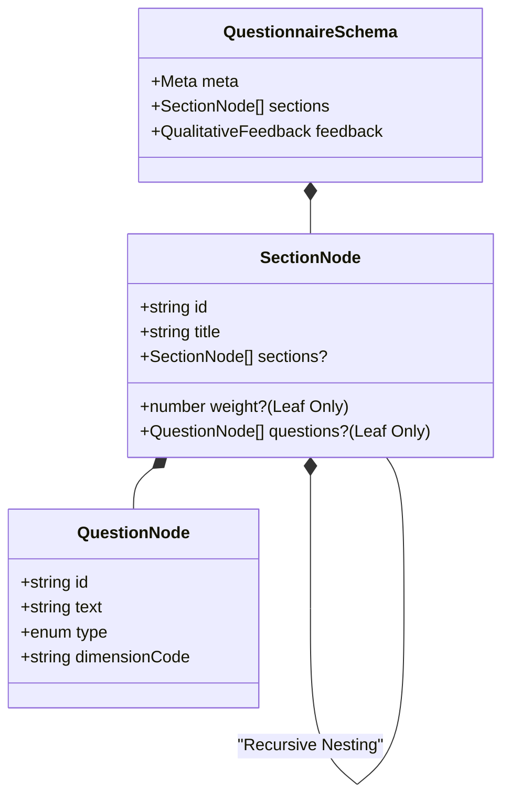
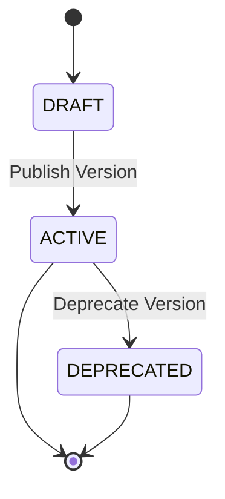

The Questionnaire Management system is designed to handle complex, hierarchical assessment frameworks with strict mathematical integrity for scoring and longitudinal tracking.

## 1. Core Data Model

The system separates the identity of a questionnaire from its specific content versions.

## 2. Schema Architecture (JSONB)

Instead of a complex relational tree for questions and sections (which makes versioning and querying slow), we use a **validated JSONB tree**. This allows for recursive nesting while maintaining high performance.

### Structural Rules (Recursive Hierarchy)

### The "Leaf-Weight" Rule

To ensure scoring mathematical integrity, the following rules are enforced by the `QuestionnaireSchemaValidator`:

1.  **Mutual Exclusivity**: A section can either contain sub-sections **OR** questions, never both.
2.  **Weight Placement**: Weights (`number`) can **ONLY** be assigned to "Leaf" sections (sections containing questions).
3.  **The 100% Rule**: The sum of all leaf section weights within a single version must equal exactly **100**.

**Why?** This guarantees that every question belongs to a weighted bucket, making the calculation of a normalized score (0-100) mathematically trivial and deterministic.

## 3. Versioning & Immutability

Questionnaires follow a strict lifecycle to ensure that historical submission data remains valid even if the questionnaire changes.

- **States and Transitions**: Questionnaires progress through `DRAFT`, `ACTIVE`, and `DEPRECATED` states.
  - `DRAFT`: Editable, but cannot accept submissions.
  - `ACTIVE`: Accepts submissions, read-only. Only one `ACTIVE` version per questionnaire at any time.
  - `DEPRECATED`: Cannot accept new submissions, read-only, but historical submissions linked to it remain accessible.
  - Transition: `DRAFT` can be `PUBLISHED` to `ACTIVE`. An `ACTIVE` version can be manually `DEPRECATED`. Publishing a new version automatically `DEPRECATES` the previously `ACTIVE` version.
- **Single Draft Rule**: Only one `DRAFT` version can exist for a given `Questionnaire` at any time, preventing conflicting edits.
- **Version Templating**: Admins can seed a new draft from any non-draft version via `POST /questionnaires/:id/versions/from-template { sourceVersionId }`. The service deep-copies `schemaSnapshot` (via `structuredClone`), assigns the next sequential version number, and creates the record as `DRAFT` / `isActive: false`. Rejects with 400 if the source belongs to a different questionnaire or is itself a draft, 409 if a draft already exists (single-draft rule), and 400 if the questionnaire is `ARCHIVED`. All work runs inside a single `unitOfWork.runInTransaction`; the `QUESTIONNAIRE_VERSIONS` cache namespace is invalidated post-commit.
- **Strict Incremental Versioning**: `QuestionnaireVersion` numbers are strictly sequential (v1, v2, v3...), enforced by the system to prevent skipping and maintain a clear audit trail.
- **Submission Linking**: All submissions are permanently linked to the specific `QuestionnaireVersion` they were made against, ensuring data immutability and historical accuracy.
- **Editing and Submissions**: Only `DRAFT` versions are editable. Only `ACTIVE` versions accept submissions.
- **Historical Accessibility**: Submissions linked to `DEPRECATED` versions remain fully accessible for historical analysis and comparison, queryable via registered dimensions.

## 4. Design Justifications

### Questionnaire Versioning Decisions

- **Questionnaire Status Alignment**: The existing `QuestionnaireStatus` enum (`DRAFT`, `PUBLISHED`, `ARCHIVED`) has been aligned with the new lifecycle states: `DRAFT`, `ACTIVE`, `DEPRECATED`. `PUBLISHED` maps to `ACTIVE`.
- **Deprecation Safeguards (UI/Global Control)**: The UI provides warnings to administrators about the consequences of deprecating an Active version (e.g., number of existing submissions). A global activation/deactivation mechanism for active forms complements individual version states.
- **Historical Data Querying (Dimension-backed)**: Historical submissions are queryable using a dimension-backed approach, relying on a registry of standardized dimensions. This ensures data consistency and comparability across different questionnaire versions.
- **User Experience for Deprecated Versions**: Users attempting to access a deprecated questionnaire version receive a clear message and are redirected to the latest `ACTIVE` version (if one exists).

### Why JSONB for the Schema?

- **Flexibility**: Institutional questionnaires often change structure (adding sub-sections). JSONB handles this without schema migrations.
- **Atomic Loading**: Fetching a complete questionnaire for the UI requires one database read instead of recursive joins.
- **Integrity**: We use NestJS/Zod and a custom `QuestionnaireSchemaValidator` to ensure the JSON matches our strict rules before it ever hits the database.

### Why Decouple Dimensions?

Dimensions (e.g., "Clarity", "Organization") are stored in a global registry. Question nodes in the JSON schema reference these by a stable `dimensionCode`.

- **Cross-Questionnaire Analytics**: This allows the system to compare "Clarity" scores across different types of questionnaires (Student Feedback vs. Peer Review).

### Institutional Snapshotting

When a questionnaire is submitted, we don't just store IDs. We snapshot the current `Campus`, `Department`, and `Course` names.

- **Justification**: If a Department is renamed next year, historical feedback for "Dept A" should not retroactively move to "Dept B" in reports. It preserves the institutional state at the moment of feedback.

## 5. Bulk Ingestion & Orchestration

The system provides a robust orchestration layer for ingesting bulk questionnaire data from external sources (e.g., historical CSVs, external APIs).

### The Ingestion Engine

The `IngestionEngine` processes asynchronous streams of submission data using a high-performance orchestration model:

- **Bounded Concurrency:** Processes multiple records simultaneously using `p-limit` (default 6) to maximize throughput without overwhelming the database connection pool.
- **Per-Record Isolation:** Each record is processed in a forked `EntityManager` and its own transaction. A failure in one record does not affect others.
- **Speculative Dry-Runs:** Executes the complete business logic, including database constraints and triggers, but uses a custom `DryRunRollbackError` to ensure the transaction is always rolled back.
- **Deduplicated Mapping:** Uses `IngestionMapperService` with a request-scoped `DataLoader` to cache institutional entity lookups (Users, Courses, Semesters) across concurrent workers.
- **Resource Safety:** Implements hard memory limits (5,000 records) and automatic backpressure if the processing queue grows too large.

### Concrete Adapters (CSV & Excel)

- **Streaming-first**: Both adapters return `AsyncIterable<IngestionRecord>` and never buffer the entire file.
- **Header normalization**: Keys are trimmed, lowercased, stripped of non-alphanumerics (keeping `_` and `-`), and de-duplicated with suffixes (`_1`, `_2`).
- **CSV configuration**: Supports `delimiter`, `quote`, `escape`, and `separator` options.
- **Excel configuration**: Supports `sheetName` or 1-based `sheetIndex` selection.
- **Row identification**: `sourceIdentifier` is 1-based for data rows (header row excluded).

## 6. Admin Test Submission Generator

For development and staging, `AdminGenerateController` (mounted at `/admin/generate-submissions`, `SUPER_ADMIN` only) produces synthetic-but-realistic submissions without touching the CSV ingestion pipeline.

### Endpoints

| Method | Path | Purpose |
| --- | --- | --- |
| GET | `/admin/generate-submissions/status` | Reports `{ totalEnrolled, alreadySubmitted, availableStudents }` for a target `versionId + facultyUsername + courseShortname` |
| POST | `/admin/generate-submissions/preview` | Builds a preview of generated rows (questions + Likert answers + optional LLM comments) without persisting |
| POST | `/admin/generate-submissions/commit` | Persists up to 200 rows at a time via the real submission service path |

Selection uses one of two filter flows supported by new routes on `AdminFiltersController`:

- Faculty-first: `GET /admin/filters/faculty` → `GET /admin/filters/courses?facultyUsername=...`
- Type-first: `GET /admin/filters/questionnaire-types` → `GET /admin/filters/questionnaire-versions?typeId=...`

### Why the Ingestion Pipeline Is Bypassed

Commit calls `QuestionnaireService.submitQuestionnaire()` directly per row rather than routing through the `IngestionEngine`:

- The ingestion pipeline is shaped around file-sourced records (CSV/Excel) and its mapper assumes external identifiers, header normalization, and row-based error reporting. Test generation already has structured data in-hand.
- Going through the real service path preserves validation, FK resolution, and BullMQ analysis-job dispatch so the generated submissions exercise the full pipeline that production submissions hit.
- On per-row failure the service calls `em.clear()` before processing the next row — a failed commit inside a MikroORM fork leaves tracked entities in an inconsistent state, and clearing forces a clean slate without aborting the batch.

### Comment Generation

`CommentGeneratorService` uses OpenAI `gpt-4o-mini` to produce multilingual (Filipino/English/code-switched) comments that match the real corpus's noise profile. A deterministic fallback is used when `OPENAI_API_KEY` is missing or the call fails, so the generator remains usable in environments without LLM access.
