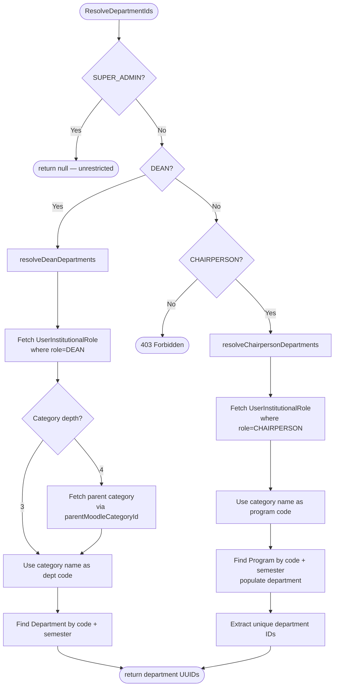

The `ScopeResolverService` enforces role-based data boundaries. Scoped endpoints (faculty list, analytics, reports) call it to determine which departments or programs the current user is authorized to access for a given semester.

## Moodle Category Hierarchy

Scope resolution depends on the Moodle category tree. Each entity in the domain maps 1:1 to a Moodle category at a specific depth:

```
Depth 1 — Campus       (e.g., "UCMN")
Depth 2 — Semester      (e.g., "S22526")
Depth 3 — Department    (e.g., "CCS")
Depth 4 — Program       (e.g., "BSCS")
```

Each `MoodleCategory` record stores `depth`, `path` (e.g., `/3/6/8/18`), and `parentMoodleCategoryId`. The domain entities (`Campus`, `Semester`, `Department`, `Program`) each store a `moodleCategoryId` matching their corresponding category.

### Cross-Semester Category IDs

Each semester in Moodle creates a **separate category sub-tree**. The same logical department (e.g., "CCS") has a different `moodleCategoryId` under each semester:

```
Campus 3 (UCMN)
  ├── Semester 6 (S22526)
  │     └── Department moodleCategoryId=8  (CCS)
  │           └── Program moodleCategoryId=18 (BSCS)
  └── Semester 50 (S12627)
        └── Department moodleCategoryId=60 (CCS)   ← different ID, same dept
              └── Program moodleCategoryId=72 (BSCS)
```

This means **`moodleCategoryId` is semester-specific** and cannot be used to look up entities across semesters. The scope resolver uses `code` (which equals `MoodleCategory.name` and is consistent across semesters) instead.

## Role Assignment

Institutional roles are stored in `UserInstitutionalRole`, linking a user + role + `MoodleCategory`:

| Role | Expected Depth | Source | Assigned At |
| --- | --- | --- | --- |
| DEAN | 3 (department) | `manual` | Admin endpoint |
| CHAIRPERSON | 4 (program) | `auto` or `manual` | Moodle hydration or admin |

### DEAN Depth Auto-Resolution

The admin endpoint (`POST /admin/users/:id/institutional-roles`) auto-resolves DEAN assignments:

- **Depth 4 (program)**: Automatically navigated to parent department (depth 3) via `parentMoodleCategoryId`
- **Depth 3 (department)**: Accepted as-is
- **Other depths**: Rejected with `400 Bad Request`

This prevents misassignment when an admin selects a program-level category for a Dean (a common mistake when promoting a Chairperson to Dean, since the Chairperson's existing role points to a program).

## Resolution Logic

### `ResolveDepartmentIds(semesterId)`

Returns `string[] | null` — the set of department UUIDs the user may access, or `null` for unrestricted.



### `ResolveProgramIds(semesterId)`

Returns `string[] | null` — program UUIDs, or `null` for unrestricted.

| Role | Behavior |
| --- | --- |
| SUPER_ADMIN | `null` (unrestricted) |
| DEAN | `null` (sees all programs in their departments) |
| CHAIRPERSON | Returns specific program UUIDs matching their institutional role codes |

### `ResolveProgramCodes(semesterId)`

Returns `string[] | null` — program **codes** instead of UUIDs, for consumers that filter against snapshotted string columns rather than FK relations.

| Role | Behavior |
| --- | --- |
| SUPER_ADMIN | `null` (unrestricted) |
| DEAN | `null` (sees all programs in their departments) |
| CHAIRPERSON | Returns program codes matching their institutional role assignments |
| Other | `ForbiddenException` |

Used by `AnalyticsService` to narrow queries against `mv_faculty_semester_stats.program_code_snapshot`. The chairperson branch shares a private `resolveChairpersonPrograms(userId, semesterId)` helper with `ResolveProgramIds` — category→program lookup logic is not duplicated.

## Consumers

The following services call `ScopeResolverService`:

| Service | Method | What It Scopes |
| --- | --- | --- |
| `FacultyService` | `ListFaculty` | Faculty list filtered by department |
| `AnalyticsService` | `ResolveDepartmentCodes` | Analytics queries filtered by department |
| `ReportsService` | Various | Report generation scoped to department |
| `CurriculumService` | Various | Curriculum data scoped to department/program |

### How Consumers Use the Result

```typescript
const departmentIds = await scopeResolver.ResolveDepartmentIds(semesterId);

if (departmentIds === null) {
  // Unrestricted — no department filter applied
} else if (departmentIds.length === 0) {
  // No access — query short-circuits to empty result
} else {
  // Filter: WHERE department_id IN (departmentIds)
}
```

## Key Design Decisions

### Why Match by Code Instead of moodleCategoryId

`Department.code` and `Program.code` are set from `MoodleCategory.name` during sync (`moodle-category-sync.service.ts`). They are semantically stable across semesters — "CCS" is always "CCS" regardless of which semester sub-tree it lives under.

By contrast, `moodleCategoryId` is a Moodle-internal integer that differs per semester. Matching by it would only work for the specific semester the role was originally assigned under.

### Why DEAN Supports Depth 4 in the Scope Resolver

Even though the admin endpoint now auto-resolves DEAN to depth 3, existing `UserInstitutionalRole` records may still reference depth-4 categories (created before the validation was added). The scope resolver handles both depths defensively:

- **Depth 3**: Uses `moodleCategory.name` directly as the department code
- **Depth 4**: Fetches the parent `MoodleCategory` (via `parentMoodleCategoryId`) and uses its `name`

### Role Priority

When a user holds multiple roles, the highest-priority role wins:

1. `SUPER_ADMIN` — unrestricted (`null`)
2. `DEAN` — department-level scope
3. `CHAIRPERSON` — program-level scope (narrower)

## Source Files

| File | Purpose |
| --- | --- |
| `src/modules/common/services/scope-resolver.service.ts` | Core resolution logic |
| `src/modules/common/services/scope-resolver.service.spec.ts` | Unit tests |
| `src/modules/admin/services/admin.service.ts` | DEAN depth validation on assignment |
| `src/entities/user-institutional-role.entity.ts` | Role ↔ MoodleCategory link |
| `src/entities/moodle-category.entity.ts` | Hierarchy fields (depth, path, parentMoodleCategoryId) |
| `src/modules/moodle/services/moodle-category-sync.service.ts` | Sets Department.code / Program.code from MoodleCategory.name |
