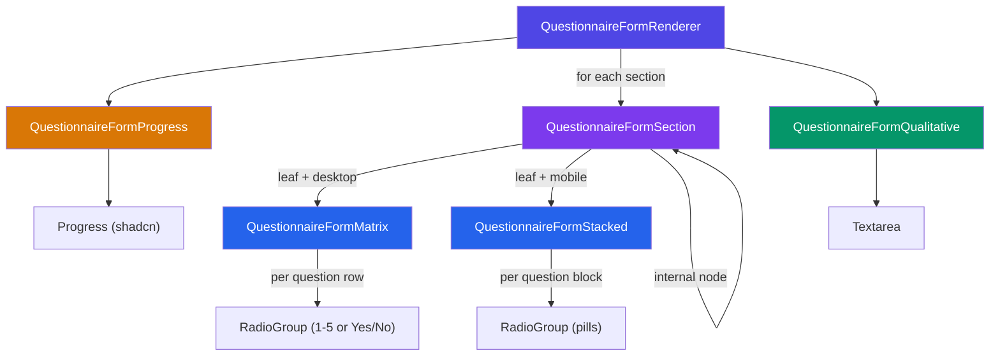
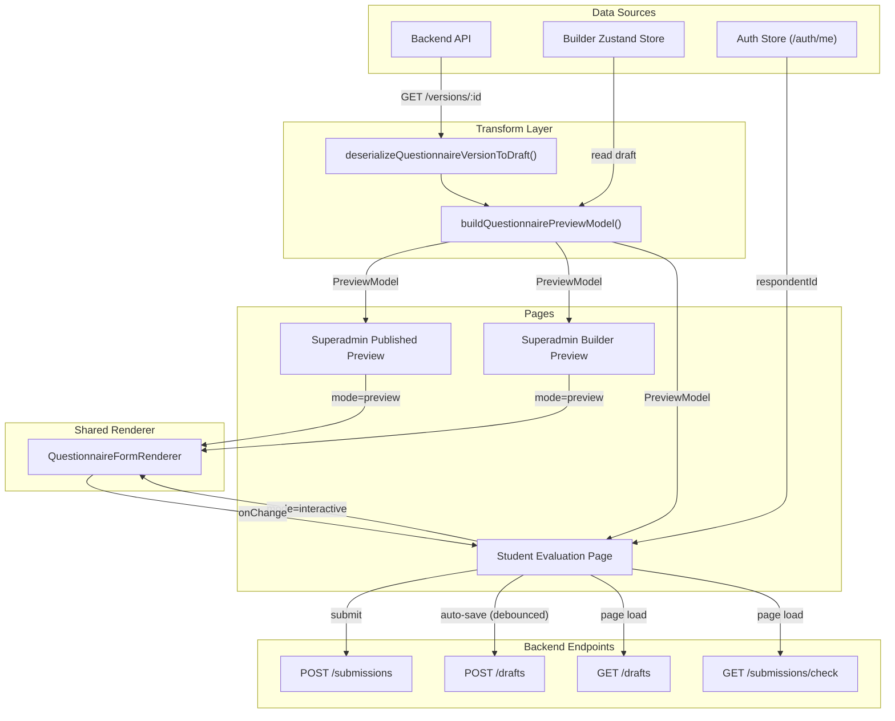
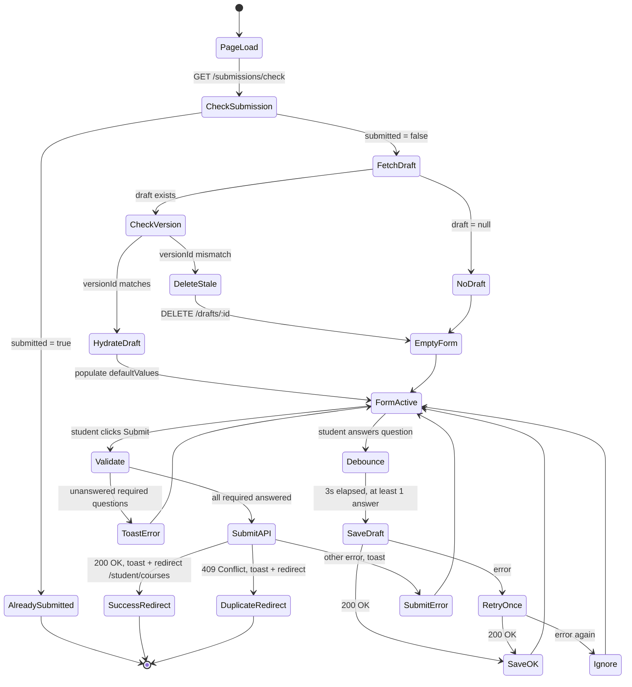

This document describes the shared questionnaire form renderer — a single component that powers both the **superadmin questionnaire preview** and the **student faculty evaluation form**.

---

## 1. Problem

The platform needs to render questionnaire forms in two contexts:

1. **Superadmin preview** — read-only simulation of the student experience, used to verify a questionnaire before publishing.
2. **Student evaluation** — live, interactive form where students rate faculty and optionally leave qualitative comments.

Both contexts render the same questionnaire schema in the same visual layout. The only differences are interactivity (disabled vs. enabled inputs) and what happens with the data (nothing vs. submission/draft-save). Building two separate renderers would duplicate layout logic and risk visual drift between what the admin previews and what the student actually sees.

---

## 2. Solution

A single `QuestionnaireFormRenderer` component that accepts a `mode` prop:

- `mode="preview"` — all inputs disabled, no form state, no submission logic. Section weights are **visible** (admin needs to verify weighting).
- `mode="interactive"` — inputs enabled, tracks answer state internally, exposes values to the parent for submission. Section weights are **hidden** (showing weights could bias students toward higher-weighted sections).

The component consumes the existing `QuestionnaireBuilderPreviewModel` type, which is already produced by the builder serializer (`buildQuestionnairePreviewModel`) and the version deserializer (`deserializeQuestionnaireVersionToDraft`). No new data transformations are needed.

---

## 3. Why a Likert Matrix Table

A real questionnaire has **49 questions across 5 sections** (the largest section, "Teaching and Learning Process", has 17 questions). All questions use the `LIKERT_1_5` scale.

The previous preview used a **card-per-question** layout — each question got its own block with 5 horizontally-laid radio buttons and descriptive labels ("Strongly disagree", "Disagree", etc.). This works for a handful of questions, but at 49 questions it creates excessive vertical scroll and contributes to survey fatigue.

A **Likert matrix table** is the standard format for academic evaluation instruments:

- Rows are questions, columns are scale points (1–5).
- The scale labels are shown once in the table header, not repeated per question.
- Each section is its own table within a card, preserving visual grouping and weight display.

This is significantly more compact and scannable. The "Teaching and Learning Process" section goes from 17 separate card blocks (~1700px) to one table (~850px).

### Desktop Layout (md and above)

```
┌───────────────────────────────────────────────────────────────────┐
│  I. Preparation                                     Weight: 15%  │
├─────────────────────────────────────────┬──┬──┬──┬──┬────────────┤
│                                         │1 │2 │3 │4 │5           │
├─────────────────────────────────────────┼──┼──┼──┼──┼────────────┤
│ 1. Prepares the course syllabus and     │○ │○ │○ │○ │○           │
│    presents it to the students...       │  │  │  │  │            │
├─────────────────────────────────────────┼──┼──┼──┼──┼────────────┤
│ 2. Orients the students on the grading  │○ │○ │○ │● │○           │
│    system, course requirements...       │  │  │  │  │            │
├─────────────────────────────────────────┼──┼──┼──┼──┼────────────┤
│ 3. Follows the topic outline in the     │○ │○ │○ │○ │○           │
│    course syllabus.                     │  │  │  │  │            │
└─────────────────────────────────────────┴──┴──┴──┴──┴────────────┘
```

Each section card contains a table. The header row shows scale points 1–5. Each question is a row with radio buttons aligned under the corresponding column. The question text occupies the wide left column. Radio columns are narrow and fixed-width.

### Mobile Layout (below md)

```
┌─────────────────────────────┐
│ I. Preparation     Wt: 15%  │
├─────────────────────────────┤
│                             │
│ 1. Prepares the course      │
│    syllabus and presents    │
│    it to the students at    │
│    the beginning of the     │
│    semester.                │
│                             │
│  ┌──┐ ┌──┐ ┌──┐ ┌──┐ ┌──┐  │
│  │○1│ │○2│ │○3│ │●4│ │○5│  │
│  └──┘ └──┘ └──┘ └──┘ └──┘  │
│                             │
│ 2. Orients the students on  │
│    the grading system,      │
│    course requirements,     │
│    and class policies.      │
│                             │
│  ┌──┐ ┌──┐ ┌──┐ ┌──┐ ┌──┐  │
│  │○1│ │○2│ │○3│ │○4│ │○5│  │
│  └──┘ └──┘ └──┘ └──┘ └──┘  │
│                             │
└─────────────────────────────┘
```

On mobile, the table collapses into a stacked layout. Each question gets its own block: the question text on top, followed by a horizontal row of compact pill-style radio buttons labeled 1–5. The full scale descriptions ("Strongly Disagree", etc.) are not repeated here — they are already displayed in the `QuestionnaireRatingScaleInstructions` card at the top of the page, which both preview and evaluation pages render.

### Nested Sections (Subsections)

When a section has child sections instead of questions (internal node), the outer section renders as a container card with its title, and each child section renders its own matrix table inside. The outer section does **not** have a weight — only leaf sections (the ones with questions) carry weights.

**Desktop — Nested Sections:**

```
┌───────────────────────────────────────────────────────────────────┐
│  II. Teaching and Learning Process                               │
│                                                                  │
│  ┌───────────────────────────────────────────────────────────┐   │
│  │  A. Classroom Management                    Weight: 20%   │   │
│  ├─────────────────────────────────┬──┬──┬──┬──┬─────────────┤   │
│  │                                 │1 │2 │3 │4 │5            │   │
│  ├─────────────────────────────────┼──┼──┼──┼──┼─────────────┤   │
│  │ 1. Starts and ends the class   │○ │○ │○ │● │○            │   │
│  │    on time.                    │  │  │  │  │             │   │
│  ├─────────────────────────────────┼──┼──┼──┼──┼─────────────┤   │
│  │ 2. Maintains discipline and    │○ │○ │○ │○ │○            │   │
│  │    order in the classroom.     │  │  │  │  │             │   │
│  ├─────────────────────────────────┼──┼──┼──┼──┼─────────────┤   │
│  │ 3. Handles disruptions         │○ │○ │● │○ │○            │   │
│  │    professionally.             │  │  │  │  │             │   │
│  └─────────────────────────────────┴──┴──┴──┴──┴─────────────┘   │
│                                                                  │
│  ┌───────────────────────────────────────────────────────────┐   │
│  │  B. Instructional Methods                   Weight: 15%   │   │
│  ├─────────────────────────────────┬──┬──┬──┬──┬─────────────┤   │
│  │                                 │1 │2 │3 │4 │5            │   │
│  ├─────────────────────────────────┼──┼──┼──┼──┼─────────────┤   │
│  │ 1. Uses varied and appropriate │○ │○ │○ │○ │●            │   │
│  │    teaching strategies.        │  │  │  │  │             │   │
│  ├─────────────────────────────────┼──┼──┼──┼──┼─────────────┤   │
│  │ 2. Integrates real-life        │○ │○ │○ │● │○            │   │
│  │    examples and current        │  │  │  │  │             │   │
│  │    trends in the discussion.   │  │  │  │  │             │   │
│  ├─────────────────────────────────┼──┼──┼──┼──┼─────────────┤   │
│  │ 3. Provides opportunities for  │○ │○ │○ │○ │○            │   │
│  │    critical thinking.          │  │  │  │  │             │   │
│  └─────────────────────────────────┴──┴──┴──┴──┴─────────────┘   │
│                                                                  │
└──────────────────────────────────────────────────────────────────┘
```

The outer card ("II. Teaching and Learning Process") has no weight badge and no table of its own — it's purely a grouping container. Each child section ("A. Classroom Management", "B. Instructional Methods") is a nested card with its own weight badge and its own Likert matrix table.

**Mobile — Nested Sections:**

```
┌──────────────────────────────┐
│ II. Teaching and Learning    │
│     Process                  │
│                              │
│ ┌──────────────────────────┐ │
│ │ A. Classroom Management  │ │
│ │                 Wt: 20%  │ │
│ ├──────────────────────────┤ │
│ │                          │ │
│ │ 1. Starts and ends the   │ │
│ │    class on time.        │ │
│ │                          │ │
│ │ ┌──┐ ┌──┐ ┌──┐ ┌──┐ ┌──┐│ │
│ │ │○1│ │○2│ │○3│ │●4│ │○5││ │
│ │ └──┘ └──┘ └──┘ └──┘ └──┘│ │
│ │                          │ │
│ │ 2. Maintains discipline  │ │
│ │    and order in the      │ │
│ │    classroom.            │ │
│ │                          │ │
│ │ ┌──┐ ┌──┐ ┌──┐ ┌──┐ ┌──┐│ │
│ │ │○1│ │○2│ │○3│ │○4│ │○5││ │
│ │ └──┘ └──┘ └──┘ └──┘ └──┘│ │
│ │                          │ │
│ └──────────────────────────┘ │
│                              │
│ ┌──────────────────────────┐ │
│ │ B. Instructional Methods │ │
│ │                 Wt: 15%  │ │
│ ├──────────────────────────┤ │
│ │                          │ │
│ │ 1. Uses varied and       │ │
│ │    appropriate teaching  │ │
│ │    strategies.           │ │
│ │                          │ │
│ │ ┌──┐ ┌──┐ ┌──┐ ┌──┐ ┌──┐│ │
│ │ │○1│ │○2│ │○3│ │○4│ │●5││ │
│ │ └──┘ └──┘ └──┘ └──┘ └──┘│ │
│ │                          │ │
│ └──────────────────────────┘ │
│                              │
└──────────────────────────────┘
```

The same nesting principle applies — the outer section is a container, child sections are nested cards inside it. This works up to 4 levels deep (the `MAX_SECTION_NESTING_LEVEL` constant). At deeper levels, the visual indentation continues through nested card borders, though in practice most questionnaires use 1–2 levels.

### YES_NO Sections

Each section enforces a single question type — a section contains either all `LIKERT_1_5` questions or all `YES_NO` questions, never a mix. This is enforced by the builder (each section node has a `questionType` field).

For a `YES_NO` section, the matrix table doesn't apply (there's no 1–5 scale). Instead, the section renders a two-column table with "Yes" and "No" headers.

**Desktop — YES_NO Section:**

```
┌───────────────────────────────────────────────────────────────────┐
│  III. Compliance Checks                            Weight: 10%   │
├──────────────────────────────────────────────────┬─────┬──────────┤
│                                                  │ Yes │ No       │
├──────────────────────────────────────────────────┼─────┼──────────┤
│ 1. Submits grades on or before the deadline.     │  ○  │  ○       │
├──────────────────────────────────────────────────┼─────┼──────────┤
│ 2. Holds the required number of class hours      │  ○  │  ●       │
│    per semester.                                 │     │          │
├──────────────────────────────────────────────────┼─────┼──────────┤
│ 3. Follows the university's code of conduct.     │  ●  │  ○       │
├──────────────────────────────────────────────────┼─────┼──────────┤
│ 4. Complies with institutional safety            │  ○  │  ○       │
│    protocols.                                    │     │          │
└──────────────────────────────────────────────────┴─────┴──────────┘
```

Same table structure as Likert sections, just with two columns instead of five. The header labels are "Yes" and "No" instead of scale numbers.

**Mobile — YES_NO Section:**

```
┌─────────────────────────────┐
│ III. Compliance Checks      │
│                    Wt: 10%  │
├─────────────────────────────┤
│                             │
│ 1. Submits grades on or     │
│    before the deadline.     │
│                             │
│      ┌─────┐  ┌────┐       │
│      │○ Yes│  │○ No│       │
│      └─────┘  └────┘       │
│                             │
│ 2. Holds the required       │
│    number of class hours    │
│    per semester.            │
│                             │
│      ┌─────┐  ┌────┐       │
│      │○ Yes│  │● No│       │
│      └─────┘  └────┘       │
│                             │
│ 3. Follows the university's │
│    code of conduct.         │
│                             │
│      ┌─────┐  ┌────┐       │
│      │● Yes│  │○ No│       │
│      └─────┘  └────┘       │
│                             │
└─────────────────────────────┘
```

On mobile, each question stacks with two pill-style radio buttons side by side. The pills are wider than the Likert pills to accommodate the "Yes" / "No" labels.

**Numeric mapping:** Yes maps to `5` and No maps to `1` in the `answers` record (scale-aligned). This keeps YES_NO scoring consistent with the Likert 1–5 range — a "Yes" contributes the same as a "Strongly Agree", and a "No" equals "Strongly Disagree". If we used boolean-style values (1/0), YES_NO sections would be systematically penalized in the weighted average regardless of their weight, making the weight system misleading. The backend scoring service treats all answer values as raw numbers with no question-type-specific transformation, so the frontend is responsible for sending scale-aligned values.

### Qualitative Feedback

If `qualitative.enabled` is `true` in the schema, a comments card renders below all sections:

- Shows a `Textarea` with the configured `maxLength`.
- Displays a "Required" badge if `qualitative.required` is `true`.
- In preview mode, the textarea is disabled.
- In interactive mode, the textarea is enabled and its value is tracked as part of form state.

---

## 4. Component Architecture

### UI Components Used

All UI is built from existing shadcn primitives — no custom component library needed.

| Need | Component | Source | Notes |
|------|-----------|--------|-------|
| Radio inputs | `RadioGroup` + `RadioGroupItem` | `components/ui/radio-group` | Already in project |
| Progress bar | `Progress` | `components/ui/progress` | Add via `bunx --bun shadcn@latest add progress` |
| Section cards | `Card`, `CardHeader`, `CardContent` | `components/ui/card` | Already in project |
| Comments textarea | `Textarea` | `components/ui/textarea` | Already in project |
| Weight / required badges | `Badge` | `components/ui/badge` | Already in project |
| Toast notifications | `toast` (Sonner) | `components/ui/sonner` | Already in project |
| Matrix table | Plain HTML table + Tailwind | N/A | shadcn `Table` is designed for data tables — a plain semantic HTML table with Tailwind gives full control over the matrix layout and responsive breakpoint switch |

### File Placement

```
features/questionnaires/
  components/
    form/
      questionnaire-form-renderer.tsx    <- main component (exported)
      questionnaire-form-section.tsx     <- section card with matrix table
      questionnaire-form-matrix.tsx      <- desktop Likert matrix table
      questionnaire-form-stacked.tsx     <- mobile stacked question layout
      questionnaire-form-qualitative.tsx <- qualitative comment card
      questionnaire-form-progress.tsx    <- completion progress indicator
```

These are **feature components**, not route-local `_components`, because they are consumed by two different route trees (`/superadmin/...` and `/student/...`).

The old `questionnaire-preview-renderer.tsx` in `components/builder/` is removed and replaced by this.

### Component Hierarchy



**Responsibility breakdown:**

| Component | Owns | Receives |
|-----------|------|----------|
| `FormRenderer` | Answer state, qualitative state, completion derivation, `onChange` firing | `model`, `mode`, `defaultValues`, `onChange` |
| `FormProgress` | Progress bar rendering | `answeredCount`, `totalRequired`, `isComplete` |
| `FormSection` | Section card chrome (title, weight badge, section progress), recursion for nested sections | `section`, `mode`, `answers`, `onAnswer` |
| `FormMatrix` | Desktop table layout with scale header + question rows | `questions`, `questionType`, `mode`, `answers`, `onAnswer` |
| `FormStacked` | Mobile stacked layout with pill radio buttons | `questions`, `questionType`, `mode`, `answers`, `onAnswer` |
| `FormQualitative` | Comments card with textarea + character count | `config`, `mode`, `value`, `onChangeComment` |

### Props API

```typescript
type QuestionnaireFormMode = "preview" | "interactive";

type QuestionnaireFormAnswers = Record<string, number>;

type QuestionnaireFormValues = {
  answers: QuestionnaireFormAnswers;
  qualitativeComment: string;
};

type QuestionnaireFormRendererProps = {
  /** The questionnaire data to render. */
  model: QuestionnaireBuilderPreviewModel;

  /** Controls whether inputs are disabled (preview) or enabled (interactive). */
  mode: QuestionnaireFormMode;

  /**
   * Initial form values. Used to hydrate from a saved draft.
   * Only relevant in interactive mode.
   */
  defaultValues?: Partial<QuestionnaireFormValues>;

  /**
   * Called whenever a form value changes.
   * Only fires in interactive mode.
   */
  onChange?: (values: QuestionnaireFormValues) => void;
};
```

The component is **controlled-output, uncontrolled-input** — it manages its own internal state but pushes changes out via `onChange`. The parent doesn't need to pass values back in on every render. `defaultValues` is read once on mount (or when a draft is loaded).

### Why Not React Hook Form

React Hook Form is used elsewhere in the app for structured forms with field-level validation (e.g., the questionnaire builder metadata form). The evaluation form is different:

- The answer state is a flat `Record<string, number>` — there are no nested field objects, no field arrays, no conditional fields.
- Validation is binary: every required question must have an answer. There's no per-field error message beyond "unanswered".
- The form has 49+ dynamic fields generated from schema data, not a static set of known fields.

A plain `useState<Record<string, number>>` is simpler, more predictable, and avoids the overhead of registering 49 fields with RHF. The completion check is a derived value: compare the set of answered question IDs against the set of required question IDs from the schema.

---

## 5. Form State Model

### Answer State

```typescript
// Key: question ID from schema (e.g., "q-fb-2-7")
// Value: numeric answer (1–5 for Likert, 5 or 1 for Yes/No — scale-aligned)
const [answers, setAnswers] = useState<Record<string, number>>(
  defaultValues?.answers ?? {}
);
```

This shape matches the backend `SubmitQuestionnaireRequest.answers` and `SaveDraftRequest.answers` exactly — no transformation needed when submitting.

### Qualitative Comment State

```typescript
const [qualitativeComment, setQualitativeComment] = useState<string>(
  defaultValues?.qualitativeComment ?? ""
);
```

### Completion Tracking

Completion is derived, not stored:

```typescript
const requiredQuestionIds: string[] = /* extracted from model.sections, recursively */
const answeredCount = requiredQuestionIds.filter((id) => id in answers).length;
const totalRequired = requiredQuestionIds.length;
const isComplete = answeredCount === totalRequired
  && (!model.qualitative.required || qualitativeComment.trim().length > 0);
```

This drives:
- A progress bar showing overall completion
- The submit button's disabled state
- Visual indicators on unanswered sections (section-level progress)

### Progress Bar

The form displays a shadcn `Progress` component (from `components/ui/progress`) showing overall completion. It renders above the section cards in interactive mode and is hidden in preview mode.

```
┌──────────────────────────────────────────────────────────────┐
│  Progress: 37 / 49 questions answered                        │
│  ████████████████████████████████░░░░░░░░░░░░░░░  75%        │
└──────────────────────────────────────────────────────────────┘
```

### Section-Level Progress

Each section card can show its own completion state — e.g., "5 / 5" next to the section title. This is computed by filtering `answers` keys against the question IDs belonging to that section. This helps students identify which sections they haven't finished, especially in a 49-question form.

---

## 6. Data Flow

### Overview



### Superadmin Preview

```
Superadmin navigates to preview page
  -> page fetches QuestionnaireVersionDetail (or reads from builder store)
  -> deserializeQuestionnaireVersionToDraft() -> QuestionnaireBuilderDraft
  -> buildQuestionnairePreviewModel() -> QuestionnaireBuilderPreviewModel
  -> QuestionnaireFormRenderer model={model} mode="preview"
```

No form state, no API calls, no submission. The component just renders disabled inputs.

### Student Evaluation

The student evaluation always uses the `FACULTY_FEEDBACK` questionnaire type. The page fetches the active published version for this type.

```
Student navigates to /student/courses/:courseId/evaluation
  -> page resolves enrollment context (course, faculty, semester from enrollment.semester)
  -> page fetches active FACULTY_FEEDBACK version via fetchQuestionnaireVersionsByType("FACULTY_FEEDBACK")
  -> page checks if student already submitted (GET /questionnaires/submissions/check)
      -> if yes: render "already submitted" state (no form)
      -> if no: continue
  -> deserialize + buildPreviewModel (same pipeline as preview)
  -> page fetches existing draft via GET /questionnaires/drafts?versionId=...&facultyId=...&semesterId=...
      -> if draft exists AND draft.versionId matches active version: hydrate as defaultValues
      -> if draft exists BUT versionId mismatches: discard stale draft, start fresh
      -> if no draft: start with empty form
  -> QuestionnaireFormRenderer
      model={model}
      mode="interactive"
      defaultValues={draft}    <- hydrate from saved draft if exists
      onChange={handleChange}  <- capture values for auto-save and submit
```

The page (not the renderer) owns submission and draft-save logic:

- **Draft auto-save**: debounced `onChange` (3-second debounce) triggers `POST /questionnaires/drafts`. See [Draft Auto-Save](#draft-auto-save) for details.
- **Submit**: button calls `POST /questionnaires/submissions` with the current form values plus context IDs (versionId, respondentId, facultyId, semesterId, courseId). The `respondentId` is the authenticated user's ID, obtained from the auth store (`/auth/me`). The submit button shows a loading spinner while the request is in flight and is disabled to prevent double-clicks.
- **On success**: success toast is shown, student is redirected to `/student/courses`.
- **On 409 (duplicate)**: toast error "You have already submitted this evaluation", redirect to `/student/courses`. This is a fallback — the proactive check should catch most cases.
- **Validation**: if the student clicks submit with unanswered required questions, a toast error is shown (no inline per-field errors).

### Already Submitted State

If the student has already submitted an evaluation for the current faculty + course + semester combination, the page renders an "already submitted" state instead of the form. This prevents duplicate submissions.

- **Proactive check**: `GET /questionnaires/submissions/check?versionId=...&facultyId=...&semesterId=...&courseId=...` on page load ([FAC-63](https://github.com/CtrlAltElite-Devs/api.faculytics/issues/134)).
- **Fallback**: if the check endpoint is not yet available, the frontend handles the `409 Conflict` from `POST /submissions` gracefully — show a toast and redirect.

### Backend Dependencies

| Issue | Description | Status |
|-------|-------------|--------|
| [FAC-62](https://github.com/CtrlAltElite-Devs/api.faculytics/issues/133) | Expose active semester in enrollment context — frontend needs `semesterId` for submission and drafts | **Resolved** |
| [FAC-63](https://github.com/CtrlAltElite-Devs/api.faculytics/issues/134) | Add `GET /submissions/check` endpoint — frontend needs to proactively check if student already submitted | **Resolved** |

**FAC-62 resolution:** The `GET /enrollments/me` endpoint now includes a `semester` field on each enrollment. The frontend extracts `semesterId` from the resolved enrollment (`enrollment.semester.id`). The semester is derived from the course's program to department to semester relation chain. It can be `null` if the hierarchy is incomplete, which the evaluation page should guard against.

```typescript
// New type added to features/enrollments/types/index.ts
type SemesterShortResponseDto = {
  id: string;
  code: string;
  label?: string;
  academicYear?: string;
};

// EnrollmentResponseDto now includes:
semester?: SemesterShortResponseDto | null;
```

Both backend dependencies are now resolved. All submission, draft, and check features are fully unblocked.

**FAC-63 resolution:** `GET /questionnaires/submissions/check` accepts query params `versionId`, `facultyId`, `semesterId`, `courseId?` and returns `{ submitted: boolean, submittedAt?: Date }`. The endpoint uses `CurrentUserInterceptor` to infer the respondent from the JWT token.

### Backend API Endpoints

| Action | Method | Endpoint | Auth |
|--------|--------|----------|------|
| Submit evaluation | POST | `/api/v1/questionnaires/submissions` | Any authenticated user |
| Save / update draft | POST | `/api/v1/questionnaires/drafts` | Any authenticated user |
| Load draft | GET | `/api/v1/questionnaires/drafts?versionId=...&facultyId=...&semesterId=...` | Any authenticated user |
| List my drafts | GET | `/api/v1/questionnaires/drafts/list` | Any authenticated user |
| Delete draft | DELETE | `/api/v1/questionnaires/drafts/:id` | Any authenticated user |

### Request Shapes

**Submit** (`SubmitQuestionnaireRequest`):
```json
{
  "versionId": "uuid",
  "respondentId": "uuid",
  "facultyId": "uuid",
  "semesterId": "uuid",
  "courseId": "uuid (optional)",
  "answers": { "q-fb-1-1": 5, "q-fb-1-2": 4, "q-fb-2-1": 3 },
  "qualitativeComment": "Optional free-text comment"
}
```

**Save Draft** (`SaveDraftRequest`):
```json
{
  "versionId": "uuid",
  "facultyId": "uuid",
  "semesterId": "uuid",
  "courseId": "uuid (optional)",
  "answers": { "q-fb-1-1": 5 },
  "qualitativeComment": "Partial comment..."
}
```

- `respondentId` (submit only) is the authenticated user's ID from the auth store (`/auth/me`).
- `answers` uses question IDs from the schema as keys and numeric values as values. This is the same shape the renderer's internal state uses — no mapping needed.
- For `LIKERT_1_5` questions, values are `1`–`5`. For `YES_NO` questions, values are `5` (Yes) or `1` (No).
- Draft save does not require `respondentId` — the backend infers it from the JWT token via `CurrentUserInterceptor`.

---

## 7. Nested Sections

The questionnaire schema supports up to 4 levels of section nesting. A section can contain either **child sections** (internal node) or **questions** (leaf node). Only leaf sections have questions and weights.

The renderer handles this recursively:

- **Internal section** renders a card with a title, then recursively renders its children.
- **Leaf section** renders a card with a title, weight badge, and the Likert matrix table (desktop) or stacked layout (mobile) containing its questions.

This matches how the builder serializer already structures the `QuestionnaireBuilderPreviewModel` — the `children` and `questions` arrays on each section are mutually exclusive in practice (a section has one or the other).

---

## 8. Accessibility

- Each radio group uses a `RadioGroup` with `aria-label` set to the question text.
- In preview mode, inputs have `disabled` and `aria-disabled="true"`.
- The matrix table uses proper HTML table semantics with `thead`, `tbody`, `th scope="col"` for scale headers, and `th scope="row"` for question text.
- Focus management: tabbing through the form moves through radio groups in question order.
- The qualitative textarea has `aria-required` set based on the schema config.

---

## 9. What Gets Removed

The following component is removed and replaced by the new form renderer:

- `features/questionnaires/components/builder/questionnaire-preview-renderer.tsx`

The two superadmin preview pages that consumed it are updated to use `QuestionnaireFormRenderer` with `mode="preview"` instead:

- `app/(dashboard)/superadmin/questionnaires/preview/page.tsx`
- `app/(dashboard)/superadmin/questionnaires/new/preview/page.tsx`

Supporting components (`QuestionnairePreviewStateCard`, `QuestionnairePreviewLoadingCard`) and the preview model types remain unchanged — they are consumed by the preview pages, not the renderer itself.

---

## 10. Draft Auto-Save

The form auto-saves partial progress to the backend so students don't lose work if they close the tab, navigate away, or their session expires. This is especially important for a 49-question form.

### Behavior

| Aspect | Decision | Reason |
|--------|----------|--------|
| Debounce interval | **3 seconds** | Short enough to not lose much work, long enough to not spam the API on rapid clicks through radio buttons |
| Visual indicator | **Small "Saving..." / "Saved" text near the progress bar** | Non-intrusive, reassures the student their work is persisted without pulling attention from the form |
| On save failure | **Silent retry once, then ignore** | Draft save is a convenience feature — it shouldn't interrupt the student's flow with error toasts. If both attempts fail, the student can still submit normally |
| On page load | **Hydrate from draft if exists** | `GET /questionnaires/drafts?versionId=...&facultyId=...&semesterId=...` on mount, populate `defaultValues` |

### Stale Draft Detection

If a student has a saved draft but the questionnaire version has changed since they last saved (e.g., admin deprecated v1 and published v2), the draft's `versionId` won't match the current active version. The question IDs in the draft may not exist in the new schema.

The page must detect this mismatch and **discard the stale draft** rather than hydrating mismatched question IDs into the form. The flow:

```
active version ID = fetched from API
draft version ID  = draft.versionId from GET /questionnaires/drafts

if draft exists AND draft.versionId === active version ID:
  -> hydrate form with draft.answers and draft.qualitativeComment
if draft exists AND draft.versionId !== active version ID:
  -> delete stale draft via DELETE /questionnaires/drafts/:id
  -> start with empty form
if no draft:
  -> start with empty form
```

### Save Trigger

The debounced save fires from the `onChange` callback. It only saves when at least one answer exists (no empty saves). The save payload includes all current answers and the qualitative comment, even if partially filled — the backend's `SaveDraftRequest` accepts partial data.

### Draft Lifecycle



---

## 11. Performance

With 49+ radio groups, every answer change triggers a `setState` on the top-level `answers` record. Without optimization, this re-renders the entire form tree on each click.

### Memoization Strategy

- **`QuestionnaireFormSection`** — wrap with `React.memo`. It only needs to re-render when its own section's answers change, not when answers in other sections change.
- **`QuestionnaireFormMatrix`** and **`QuestionnaireFormStacked`** — wrap with `React.memo`. Compare only the relevant slice of answers (question IDs within that section).
- **`onAnswer` callback** — stabilize with `useCallback` in the renderer. Pass a single `onAnswer(questionId: string, value: number)` function rather than creating new closures per question.
- **Answer slice derivation** — each section component can derive its own answer subset by filtering the full `answers` record against its question IDs. Use `useMemo` for this so memo comparisons work correctly.

This means a click on a radio button in Section 3 only re-renders Section 3's subtree, not all 5 sections.

---

## 12. Edge Cases

### Course Without Faculty

The `EnrollmentResponseDto` has `faculty?: FacultyShortResponseDto | null`. If a student navigates to the evaluation page for a course with no assigned faculty, the page renders an error state: **"No instructor assigned to this course. Evaluation is not available."** The form is not shown. This is handled by the page, not the renderer.

### Version Deprecated Mid-Evaluation

If the active questionnaire version is deprecated while the student is filling out the form, the submit call will fail. The page handles this gracefully:

- Backend returns an error (likely 400 or 404 for inactive version).
- Frontend shows a toast: **"This questionnaire is no longer available."**
- Student is redirected to `/student/courses`.

This is an unlikely edge case (admin deprecates while student is mid-evaluation) but should not crash or show a generic error.

### Navigation During Debounce Window

Auto-save debounces at 3 seconds. If the student closes the tab within that window, the last few answers are lost. This is acceptable — 3 seconds of data loss is minimal compared to the complexity of `beforeunload` hacks, which are unreliable on mobile and disruptive to UX. The auto-save covers 99% of cases.

### One Faculty Per Course

The current enrollment model maps one faculty member per student enrollment record. The evaluation page assumes a single faculty for the given course — it reads `enrollment.faculty` directly. If multiple faculty per course is needed in the future, the evaluation page would need a faculty selection step before rendering the form. The renderer itself is unaffected — it doesn't know or care about faculty context.

### Questionnaire Type Extensibility

The student evaluation page hardcodes `FACULTY_FEEDBACK` as the questionnaire type. However, the `QuestionnaireFormRenderer` component itself is **type-agnostic** — it renders any `QuestionnaireBuilderPreviewModel` regardless of type. The backend has a `RespondentRole` enum (`STUDENT`, `DEAN`), and the other questionnaire types (`FACULTY_IN_CLASSROOM`, `FACULTY_OUT_OF_CLASSROOM`) may be used by dean-facing evaluation pages in the future. No changes to the renderer will be needed — only a new page that fetches the appropriate type.

---

## 13. Implementation Tips

This section maps every new file to its correct location per the project's [feature-sliced architecture](/docs/frontend/architecture), with notes on where to hook things together.

### New Files — Where They Go

```
features/questionnaires/
  components/
    form/                                         <- NEW directory
      questionnaire-form-renderer.tsx             <- main renderer (export from barrel)
      questionnaire-form-section.tsx              <- section card, recursion for nesting
      questionnaire-form-matrix.tsx               <- desktop table matrix
      questionnaire-form-stacked.tsx              <- mobile stacked pills layout
      questionnaire-form-qualitative.tsx          <- qualitative comment card
      questionnaire-form-progress.tsx             <- progress bar component
  api/
    questionnaire.requests.ts                     <- ADD submission/draft request functions here
  hooks/
    use-submit-evaluation.ts                      <- NEW: useMutation for POST /submissions
    use-save-draft.ts                             <- NEW: useMutation for POST /drafts
    use-evaluation-draft.ts                       <- NEW: useQuery for GET /drafts
    use-check-submission.ts                       <- NEW: useQuery for GET /submissions/check
    use-active-questionnaire-version.ts           <- NEW: useQuery to fetch active version by type
  types/
    index.ts                                      <- ADD QuestionnaireFormMode, QuestionnaireFormValues, etc.
  index.ts                                        <- export QuestionnaireFormRenderer + new hooks
```

**Why `features/questionnaires/components/form/`?** These components are consumed by two route trees (`/superadmin/...` and `/student/...`), so they must live in the feature slice — not in route-local `_components/`. Per ARCHITECTURE.md section 5: "Use a feature slice when the code belongs to a domain, not a single route."

### Route-Level Pages — What Changes

```
app/(dashboard)/
  superadmin/
    questionnaires/
      preview/
        page.tsx                                  <- UPDATE: swap old renderer for QuestionnaireFormRenderer mode="preview"
      new/
        preview/
          page.tsx                                <- UPDATE: same swap
  student/
    courses/
      [courseId]/
        evaluation/
          page.tsx                                <- UPDATE: orchestrate evaluation flow, render QuestionnaireFormRenderer mode="interactive"
          _components/                            <- OPTIONAL: route-local components if the page grows large
            evaluation-already-submitted.tsx       <- "Already submitted" state card (only used by this route)
            evaluation-no-faculty.tsx              <- "No instructor assigned" error card
```

**Why `_components/` for evaluation sub-states?** The "already submitted" and "no faculty" cards are route-only UI — they are consumed by exactly one page. Per ARCHITECTURE.md section 5: "Use route-local `_components/` when the UI is only used by one route."

### API Request Functions

Add to the existing `features/questionnaires/api/questionnaire.requests.ts` — do **not** create a new file under `network/requests/`. Per ARCHITECTURE.md section 9: "Do not reintroduce root `network/requests/*` feature files."

```typescript
// In features/questionnaires/api/questionnaire.requests.ts — add these:

// Submissions
export const submitEvaluation = (data: SubmitEvaluationPayload) =>
  apiClient.post("/questionnaires/submissions", data).then(res => res.data);

export const checkSubmission = (params: CheckSubmissionParams) =>
  apiClient.get("/questionnaires/submissions/check", { params }).then(res => res.data);

// Drafts
export const saveDraft = (data: SaveDraftPayload) =>
  apiClient.post("/questionnaires/drafts", data).then(res => res.data);

export const fetchDraft = (params: FetchDraftParams) =>
  apiClient.get("/questionnaires/drafts", { params }).then(res => res.data);

export const deleteDraft = (draftId: string) =>
  apiClient.delete(`/questionnaires/drafts/${draftId}`).then(res => res.data);
```

### Hooks — Placement and Patterns

Each hook goes in `features/questionnaires/hooks/`. Follow existing patterns in the codebase:

- **Queries** use `useQuery` with a query key array: `["questionnaires", "submissions", "check", params]`
- **Mutations** use `useMutation` with `onSuccess`/`onError` handling toast + navigation
- Hooks own invalidation and side-effect orchestration — don't put this in page files

**Draft auto-save hook tip:** The debounced auto-save is best implemented as a `useMutation` combined with a `useRef` for the debounce timer inside a custom `useAutoSaveDraft` hook. The hook takes `onChange` values from the renderer and debounces them into `saveDraft` calls. Keep the debounce logic co-located with the mutation, not spread across the page.

### Types — Where to Add

Add new types to `features/questionnaires/types/index.ts`. The form-specific types (`QuestionnaireFormMode`, `QuestionnaireFormValues`, `QuestionnaireFormAnswers`) can live here or be co-located at the top of `questionnaire-form-renderer.tsx` if they are only consumed by the form components. If they're needed by hooks or the page, put them in the types file.

### Barrel Export

Update `features/questionnaires/index.ts` to export:
- `QuestionnaireFormRenderer` (the component)
- New hooks (`useSubmitEvaluation`, `useCheckSubmission`, `useEvaluationDraft`, `useSaveDraft`)
- New types (`QuestionnaireFormMode`, `QuestionnaireFormValues`)

Don't over-export internal form sub-components (`FormMatrix`, `FormStacked`, etc.) — they are implementation details of the renderer.

### Endpoint Constants

Add new endpoint paths to `network/endpoints.ts`:

```typescript
// Submissions
QUESTIONNAIRE_SUBMISSIONS: "/questionnaires/submissions",
QUESTIONNAIRE_SUBMISSIONS_CHECK: "/questionnaires/submissions/check",

// Drafts
QUESTIONNAIRE_DRAFTS: "/questionnaires/drafts",
```

Then reference these in the request functions instead of hardcoding path strings.

### What Gets Removed

Delete `features/questionnaires/components/builder/questionnaire-preview-renderer.tsx` and remove its import/export from any barrel files. The two superadmin preview pages should import `QuestionnaireFormRenderer` from the new `form/` directory instead.

### Import Conventions

Per ARCHITECTURE.md section 7:

```typescript
// From a page file (e.g., student evaluation page):
import { QuestionnaireFormRenderer } from "@/features/questionnaires";
import { useSubmitEvaluation, useCheckSubmission } from "@/features/questionnaires";

// From a route-local component:
import { EvaluationAlreadySubmitted } from "./_components/evaluation-already-submitted";

// From the renderer's internal sub-components:
import { QuestionnaireFormSection } from "./questionnaire-form-section"; // relative, same directory
```

### State Placement Reminder

Per ARCHITECTURE.md section 5 state placement rule:

| State | Owner | Reason |
|-------|-------|--------|
| `answers`, `qualitativeComment` | `QuestionnaireFormRenderer` | Component that renders and manages the form inputs |
| Draft auto-save debounce | `useAutoSaveDraft` hook (called in page) | Side-effect orchestration belongs in hooks |
| Submission loading/error | `useSubmitEvaluation` hook (called in page) | Mutation state belongs in hooks |
| "Already submitted" check | `useCheckSubmission` hook (called in page) | Query state belongs in hooks |
| Submit button click handler | Student evaluation page | Route-level orchestration (collects values, calls mutation, handles redirect) |

The page orchestrates hooks and passes props down. The renderer manages its own internal form state. Components own the state they render.

---

## 14. Implementation Steps

The steps below are ordered by dependency — each step builds on the previous one. Steps within the same phase can be done in any order unless noted.

### Phase 1: Types and Foundation

> Goal: Define the shared types and add the shadcn Progress component. Everything else depends on these.

**Step 1.1 — Add shadcn Progress component**

```bash
cd app.faculytics && bunx --bun shadcn@latest add progress
```

This lands in `components/ui/progress.tsx`. Needed by `QuestionnaireFormProgress`.

**Step 1.2 — Add new types**

In `features/questionnaires/types/index.ts`, add:

- `QuestionnaireFormMode` (`"preview" | "interactive"`)
- `QuestionnaireFormAnswers` (`Record<string, number>`)
- `QuestionnaireFormValues` (`{ answers: QuestionnaireFormAnswers; qualitativeComment: string }`)

These are consumed by both the renderer components and the hooks, so they must exist first.

**Step 1.3 — Add endpoint constants**

In `network/endpoints.ts`, add the new paths for submissions, submission check, and drafts. The request functions reference these.

---

### Phase 2: Renderer Components (Bottom-Up)

> Goal: Build the shared renderer starting from leaf components up to the top-level `QuestionnaireFormRenderer`. Build bottom-up so each component can be verified in isolation before composing.

**Step 2.1 — `questionnaire-form-matrix.tsx`** (leaf)

The desktop table layout. Handles both `LIKERT_1_5` (5 columns) and `YES_NO` (2 columns) based on `questionType` prop. Receives `questions`, `answers`, `onAnswer`, `mode`. Wrap with `React.memo`.

Start here because this is the core visual component — you can test it in isolation with hardcoded data before wiring anything.

**Step 2.2 — `questionnaire-form-stacked.tsx`** (leaf)

The mobile stacked pill layout. Same props as matrix. Wrap with `React.memo`. This is the responsive counterpart — same data, different layout.

**Step 2.3 — `questionnaire-form-qualitative.tsx`** (leaf)

The comments `Textarea` card. Receives `config` (from `model.qualitative`), `mode`, `value`, `onChangeComment`. Simple component — disabled in preview, enabled in interactive.

**Step 2.4 — `questionnaire-form-progress.tsx`** (leaf)

The shadcn `Progress` bar. Receives `answeredCount`, `totalRequired`, `isComplete`. Only rendered in interactive mode. Shows "37 / 49 questions answered" with percentage.

**Step 2.5 — `questionnaire-form-section.tsx`** (composite)

Depends on: Steps 2.1, 2.2.

The section card. Renders:
- Section title + weight badge (weight visible only in preview mode)
- Section-level progress count (interactive mode only)
- If **leaf section** (has questions): renders `FormMatrix` on `md+` and `FormStacked` below `md` using a responsive `hidden`/`block` switch
- If **internal section** (has children): recursively renders child `FormSection` components inside a nested card

Wrap with `React.memo`. Derive the section's answer slice via `useMemo` so memo comparisons work.

**Step 2.6 — `questionnaire-form-renderer.tsx`** (top-level)

Depends on: Steps 2.3, 2.4, 2.5.

The main exported component. Owns:
- `useState<Record<string, number>>` for answers
- `useState<string>` for qualitative comment
- Derived completion tracking (`requiredQuestionIds`, `answeredCount`, `totalRequired`, `isComplete`)
- `useCallback` for the stable `onAnswer` handler
- Fires `onChange` to parent on every state change

Renders: `FormProgress` then sections loop then `FormQualitative`.

In preview mode: no state, no `onChange`, no progress bar — just disabled inputs.

**Verification checkpoint:** At this point, you can render `QuestionnaireFormRenderer` with `model={someModel}` and `mode="preview"` in a throwaway page and see the full form with disabled inputs.

---

### Phase 3: Superadmin Preview Swap

> Goal: Replace the old preview renderer with the new one. This is the first real integration and does not require any backend changes.

**Step 3.1 — Update superadmin published preview page**

File: `app/(dashboard)/superadmin/questionnaires/preview/page.tsx`

Change the import from the old `QuestionnairePreviewRenderer` to the new `QuestionnaireFormRenderer` from `features/questionnaires/components/form/questionnaire-form-renderer`, and use `mode="preview"`.

The new renderer doesn't own back-navigation — the page keeps its own back button/link separately. The `backHref`/`backLabel` props that the old renderer accepted are handled by the page now.

**Step 3.2 — Update superadmin builder preview page**

File: `app/(dashboard)/superadmin/questionnaires/new/preview/page.tsx`

Same swap as Step 3.1. The page already has its own loading/error states via `QuestionnairePreviewLoadingCard` and `QuestionnairePreviewStateCard` — those stay unchanged.

**Step 3.3 — Delete old preview renderer**

Delete `features/questionnaires/components/builder/questionnaire-preview-renderer.tsx`. Remove any exports from barrel files. Run `bun run typecheck` to verify no dangling imports.

**Step 3.4 — Update barrel export**

In `features/questionnaires/index.ts`, export `QuestionnaireFormRenderer` from the new `form/` directory.

**Verification checkpoint:** Both superadmin preview pages (`/superadmin/questionnaires/preview` and `/superadmin/questionnaires/new/preview`) should render the new Likert matrix table layout with disabled inputs. Visually compare against the ASCII wireframes in Sections 3–4 of this doc.

---

### Phase 4: API Layer and Hooks

> Goal: Wire up the request functions and hooks. All hooks are fully unblocked.

**Step 4.1 — Add request functions**

In `features/questionnaires/api/questionnaire.requests.ts`, add the five functions: `submitEvaluation`, `checkSubmission`, `saveDraft`, `fetchDraft`, `deleteDraft`. Use the endpoint constants from Step 1.3.

**Step 4.2 — `use-active-questionnaire-version.ts`**

Fetches the active published version for a given questionnaire type (e.g., `FACULTY_FEEDBACK`). This may already be partially covered by existing hooks — check `use-questionnaire-versions.ts` first. If there's a `fetchQuestionnaireVersionsByType` request function, wrap it.

**Step 4.3 — `use-submit-evaluation.ts`**

`useMutation` wrapping `submitEvaluation`. `onSuccess`: toast + `router.push("/student/courses")`. `onError`: handle 409 (duplicate then toast + redirect), other errors then generic toast.

**Step 4.4 — `use-check-submission.ts`**

`useQuery` wrapping `checkSubmission`. Returns `{ submitted: boolean, submittedAt?: Date }`. FAC-63 is resolved — this endpoint is live.

**Step 4.5 — `use-evaluation-draft.ts`**

`useQuery` wrapping `fetchDraft`. Needs `versionId`, `facultyId`, `semesterId` params. The `semesterId` is now available from `enrollment.semester.id` (resolved by FAC-62).

**Step 4.6 — `use-save-draft.ts` / `useAutoSaveDraft`**

`useMutation` wrapping `saveDraft`, plus a custom `useAutoSaveDraft` hook that debounces `onChange` values. Includes the retry-once-then-ignore logic and the "Saving..." / "Saved" status. The `semesterId` is available from the enrollment context.

---

### Phase 5: Student Evaluation Page

> Goal: Build the interactive evaluation page. The core form works immediately; draft/submission features activate when backend dependencies ship.

**Step 5.1 — Route-local state components**

Create `app/(dashboard)/student/courses/[courseId]/evaluation/_components/`:
- `evaluation-already-submitted.tsx` — "You've already submitted" card with a back link
- `evaluation-no-faculty.tsx` — "No instructor assigned" error card

These are simple presentational components used only by this route.

**Step 5.2 — Rewrite the evaluation page**

File: `app/(dashboard)/student/courses/[courseId]/evaluation/page.tsx`

The current page is a placeholder. Replace with the full orchestration flow:

1. Resolve enrollment context (existing logic — `useSelectedCourseStore` + `useMyEnrollments` fallback)
2. Guard: no faculty then render `EvaluationNoFaculty`
3. Fetch active `FACULTY_FEEDBACK` version then deserialize then `buildQuestionnairePreviewModel`
4. Check submission status (when FAC-63 ships) then if submitted, render `EvaluationAlreadySubmitted`
5. Fetch draft (when FAC-62 ships) then hydrate as `defaultValues` if version matches
6. Render `QuestionnaireFormRenderer` with `model={model}`, `mode="interactive"`, `defaultValues={draft}`, `onChange={handleChange}`
7. Wire submit button: collect values from `onChange`, call `useSubmitEvaluation` mutation
8. Wire auto-save: pass `onChange` values to `useAutoSaveDraft`

**Tip:** The page already has the enrollment resolution logic (lines 17–44 of the current file). Keep that pattern — it handles the store-first, API-fallback approach cleanly.

**Step 5.3 — Clean up old evaluation components**

Remove the placeholder components that the old page used:
- `app/(dashboard)/student/courses/_components/faculty-evaluation-questionnaire-state.tsx` (if it was purely placeholder)
- `app/(dashboard)/student/courses/_components/faculty-evaluation-summary.tsx` (keep if it's still used for the summary header, remove if replaced)

Check if other routes import these before deleting.

**Verification checkpoint:** Navigate to `/student/courses/:courseId/evaluation`. The form should render interactively — clicking radio buttons updates state, the progress bar fills, and the submit button validates. Draft auto-save and submission check activate once FAC-62 and FAC-63 ship.

---

### Phase 6: Polish and QA

> Goal: Responsive testing, accessibility, and edge case verification.

**Step 6.1 — Responsive testing**

Test at mobile (below `md`) and desktop (`md` and above) breakpoints:
- Matrix table to stacked pills transition
- Nested sections render correctly at both sizes
- YES_NO sections show 2 pills (not 5) on mobile

**Step 6.2 — Accessibility pass**

- Tab through the entire form — radio groups should follow question order
- Screen reader: verify `aria-label` on radio groups, `scope` attributes on table headers
- Preview mode: verify `aria-disabled="true"` on all inputs

**Step 6.3 — Edge case testing**

- Course with no faculty then "No instructor assigned" state
- Empty questionnaire (no sections) then handle gracefully
- 409 on submit then toast + redirect
- Version mismatch on draft then stale draft discarded, fresh form

**Step 6.4 — Type check and lint**

```bash
cd app.faculytics && bun run typecheck && bun run lint
```

---

### Dependency Map

```
Phase 1 (types, progress, endpoints)
  |
  v
Phase 2 (renderer components, bottom-up)
  |
  |---> Phase 3 (superadmin preview swap) -- can ship independently
  |
  v
Phase 4 (API + hooks)
  |
  v
Phase 5 (student evaluation page)
  |
  v
Phase 6 (QA)
```

**All phases are fully unblocked.** Both FAC-62 (`semesterId` via enrollment) and FAC-63 (`GET /submissions/check`) are resolved. No backend dependencies remain.
