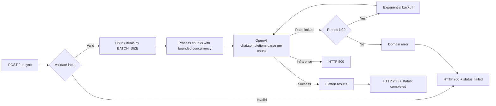

> **Temporary implementation.** This worker uses OpenAI structured output as a stand-in until the fine-tuned multilingual sentiment model is deployed on RunPod.

## Architecture

Minimal NestJS project with a single feature module:

```
src/
├── main.ts                      # Bootstrap + Swagger at /docs
├── app.module.ts                # Root module (imports SentimentModule)
├── config/
│   └── env.ts                   # Zod-validated environment config
└── sentiment/
    ├── sentiment.module.ts      # Feature module
    ├── sentiment.controller.ts  # POST /runsync, GET /health
    ├── sentiment.service.ts     # OpenAI integration + chunking
    └── dto/
        ├── sentiment-request.dto.ts   # Zod request schema
        ├── sentiment-response.dto.ts  # Zod response schemas
        └── swagger.dto.ts             # OpenAPI decorators
```

## Processing Pipeline



## OpenAI Integration

Each chunk is sent to `openai.chat.completions.parse()` with **Zod structured output** (`zodResponseFormat`), which guarantees type-safe responses matching `openaiSentimentResponseSchema`.

The system prompt instructs the model to:
- Handle **Cebuano, Tagalog, English, and code-switched** text
- Return three scores (`positive`, `neutral`, `negative`) summing to ~1.0
- Be **culturally aware** of Philippine communication patterns (softened criticism, indirect praise)
- Assign ~0.33 each for ambiguous or too-short text
- Preserve input order in results

## Chunking and Concurrency

Large batches are split into chunks for parallel processing:

| Parameter | Env Var | Default | Description |
| --- | --- | --- | --- |
| Chunk size | `OPENAI_BATCH_SIZE` | 25 | Items per OpenAI API call |
| Concurrency | `OPENAI_CONCURRENCY` | 3 | Parallel chunks in flight |

The service processes chunks in waves: up to `OPENAI_CONCURRENCY` chunks run in parallel via `Promise.all()`, then the next wave starts. This bounds both API load and memory usage.

**Example:** 100 items with batch size 25 and concurrency 3 produces 4 chunks. Chunks 1-3 process in parallel, then chunk 4 processes alone.

## Retry Logic

Only **rate limit errors** (HTTP 429 or `RateLimitError`) trigger retries:

| Attempt | Backoff |
| --- | --- |
| 1 | 2 seconds |
| 2 | 4 seconds |
| 3 | 8 seconds |

Non-rate-limit errors (auth failures, invalid requests, empty responses) fail immediately without retry. The maximum retry count is controlled by `OPENAI_MAX_RETRIES` (default 3).

## Error Classification

The controller classifies errors to determine the HTTP response:

| Error Type | Classification | HTTP Response | BullMQ Behavior |
| --- | --- | --- | --- |
| `RateLimitError` (retries exhausted) | Domain | 200 + `status: "failed"` | No retry |
| `APIError` / `AuthenticationError` | Domain | 200 + `status: "failed"` | No retry |
| Empty/unparseable response | Domain | 200 + `status: "failed"` | No retry |
| Input validation failure | Domain | 200 + `status: "failed"` | No retry |
| Network error, unhandled exception | Infrastructure | 500 | BullMQ retries |

This distinction ensures expected failures don't waste retry budget, while transient infrastructure errors are automatically retried by the API's BullMQ processor.

## Configuration

All environment variables are validated at startup via Zod (`src/config/env.ts`). The process exits immediately if validation fails.

| Variable | Required | Default | Description |
| --- | --- | --- | --- |
| `OPENAI_API_KEY` | Yes | — | OpenAI API key |
| `PORT` | No | `5210` | HTTP server port |
| `OPENAI_MODEL` | No | `gpt-4o-mini` | Model for sentiment classification |
| `OPENAI_BATCH_SIZE` | No | `25` | Items per API call |
| `OPENAI_CONCURRENCY` | No | `3` | Parallel API calls |
| `OPENAI_MAX_RETRIES` | No | `3` | Rate limit retry attempts |
| `WORKER_VERSION` | No | `1.0.0-openai` | Version string in responses |

## Deployment

Docker multi-stage build (`node:24-alpine`):

1. **Builder stage:** `npm ci` + `npm run build` (TypeScript compilation)
2. **Runtime stage:** Production dependencies only (`npm ci --omit=dev`) + compiled `dist/`
3. Exposes port `8100`, runs `node dist/main.js`

Swagger/OpenAPI documentation is available at `/docs` when the server is running.

## Migration Path

When the fine-tuned sentiment model is deployed on RunPod:

1. The RunPod worker accepts the same `{ input: BatchAnalysisJobMessage }` envelope
2. The API's `SENTIMENT_WORKER_URL` points to the RunPod endpoint instead
3. The `RunPodBatchProcessor` in the API already handles auth headers and response unwrapping
4. This temporary worker is decommissioned
