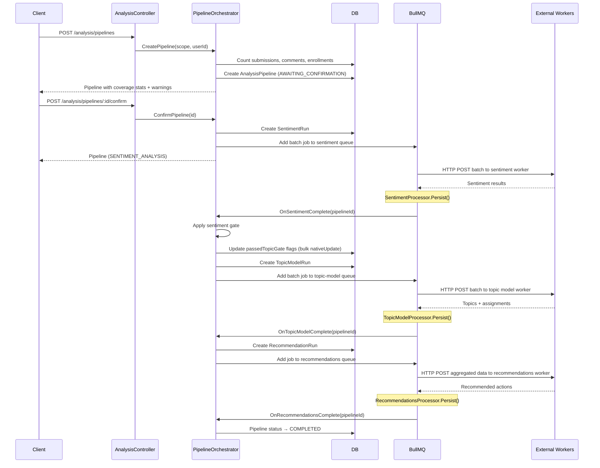
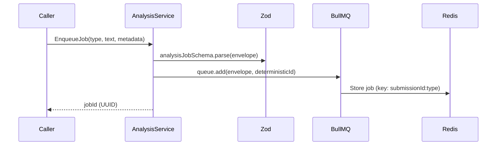
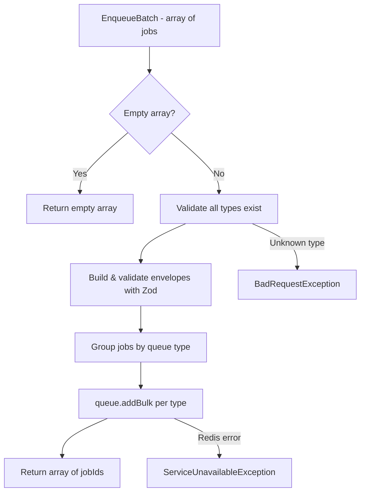
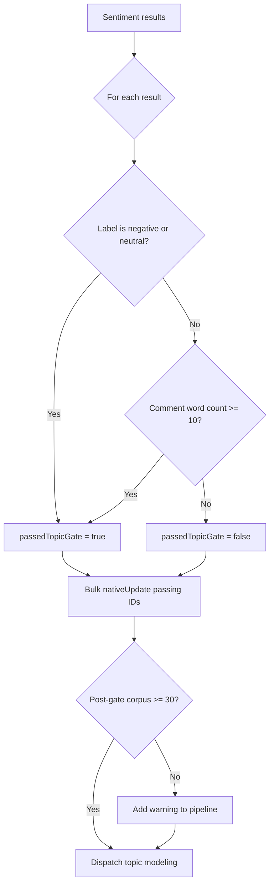

The analysis system processes qualitative feedback through a multi-stage pipeline, dispatching batch jobs to external HTTP workers via BullMQ queues.

## Pipeline-Driven Flow

## Ad-Hoc Job Flow

Individual jobs (e.g., embedding backfill) still use the original single-item `AnalysisService.EnqueueJob()` path:

## Batch Enqueue Flow

## Sentiment Gate

## Deduplication

Pipeline jobs use deterministic IDs: `${pipelineId}--${type}`. Ad-hoc jobs use: `${submissionId}--${type}`. If the same pipeline/submission + analysis type is enqueued twice, BullMQ silently rejects the duplicate.

> **Note:** BullMQ does not allow `:` in custom job IDs. The `--` separator is used instead.

## Resilience

| Mechanism | Configuration | Behavior |
| --- | --- | --- |
| Retry | `BULLMQ_DEFAULT_ATTEMPTS` (default: 3) | Exponential backoff starting at `BULLMQ_DEFAULT_BACKOFF_MS` |
| HTTP Timeout | `BULLMQ_HTTP_TIMEOUT_MS` (default: 90s) | `AbortController` cancels request; job retries. Topic model uses 300s via override |
| Stall Detection | `BULLMQ_STALLED_INTERVAL_MS` (default: 30s) | Re-queues stalled jobs up to `BULLMQ_MAX_STALLED_COUNT` times |
| Validation Failure | — | Malformed worker responses fail the stage (no retry) |
| Redis Down | — | `ServiceUnavailableException` returned to caller; API continues serving |
| Stage Failure | — | Pipeline moves to `FAILED` with error message; can be inspected via status endpoint |

## Adding a New Analysis Type

1. Create `NewTypeProcessor extends BaseBatchProcessor` (or `RunPodBatchProcessor` for RunPod workers) in `src/modules/analysis/processors/`
2. Add `NEW_TYPE_WORKER_URL` and `NEW_TYPE_CONCURRENCY` to `src/configurations/env/bullmq.env.ts`
3. Register queue in `AnalysisModule`: add to `BullModule.registerQueue()`
4. Add `@InjectQueue('new-type')` to `PipelineOrchestratorService`
5. Add dispatch and completion methods in `PipelineOrchestratorService`
6. Update `PipelineStatus` enum with new stage
7. Add worker contract doc in `docs/worker-contracts/`
8. Add mock endpoint in `mock-worker/server.ts`
