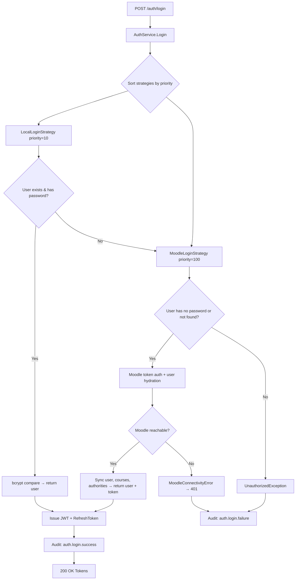
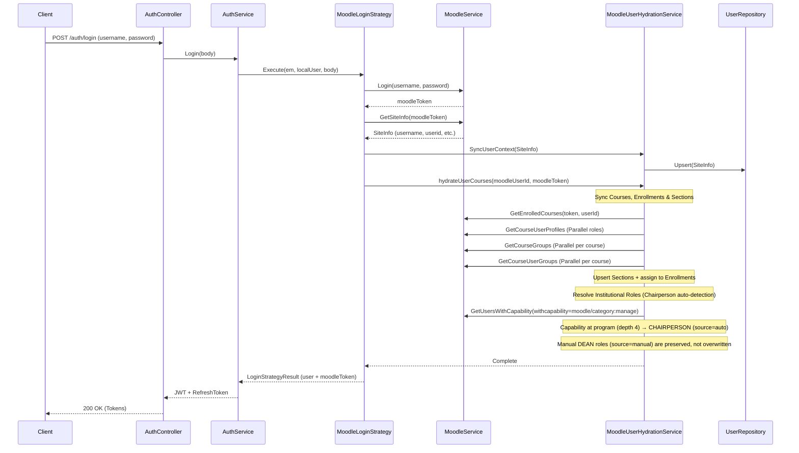

When a user logs in, the `AuthService` resolves the appropriate login strategy based on priority ordering. Strategies are evaluated in order — the first one whose `CanHandle()` returns `true` is executed.

## Login Strategy Resolution



## Moodle Login Flow (Detail)

When the `MoodleLoginStrategy` handles the request, it performs full user hydration:



## Audit Events

Auth events are captured via the direct emit path (not the interceptor) because CLS user context is unavailable during login. All emits are fire-and-forget (`void`) and occur **outside** the database transaction.

| Event                          | Action Code          | When                         | Metadata                                            |
| ------------------------------ | -------------------- | ---------------------------- | --------------------------------------------------- |
| Login success                  | `auth.login.success` | After transaction commits    | `{ strategyUsed }`                                  |
| Login failure (no strategy)    | `auth.login.failure` | After transaction rejects    | `{ username, reason: 'no_matching_strategy' }`      |
| Login failure (strategy threw) | `auth.login.failure` | After transaction rejects    | `{ username, reason: 'strategy_execution_failed' }` |
| Token refresh                  | `auth.token.refresh` | After transaction commits    | _(none)_                                            |
| Logout                         | `auth.logout`        | Via `@Audited()` interceptor | _(route params)_                                    |

`AuditService` is injected with `@Optional()` — auth works even if the audit module fails to bootstrap.

See [Audit Trail Architecture](/docs/architecture/audit-trail) for the full audit system design.

## Institutional Role Resolution

The system detects institutional management roles from Moodle category capabilities. Roles have a `source` field (`auto` or `manual`) that determines whether hydration can manage them.

### Auto-Detection (CHAIRPERSON)

1. For each enrolled course in a program category (depth 4), check `moodle/category:manage` capability.
2. If the user has the capability, assign `CHAIRPERSON` at that program (`source=auto`).
3. Auto-detected roles are re-evaluated on every login — stale ones are removed.
4. If a manual `DEAN` exists at the parent department, the auto CHAIRPERSON is skipped (DEAN subsumes it).

### Manual Assignment (DEAN)

DEAN roles are assigned by a `SUPER_ADMIN` via `POST /admin/institutional-roles`:

```json
{ "userId": "<uuid>", "role": "DEAN", "moodleCategoryId": 8 }
```

Manual roles (`source=manual`) are never modified by the hydration process. They persist across logins until explicitly removed via `DELETE /admin/institutional-roles`.

### Role Hierarchy

| Depth | Category Level | Role        | Source | Scope                      |
| ----- | -------------- | ----------- | ------ | -------------------------- |
| 3     | Department     | DEAN        | manual | All programs in department |
| 4     | Program        | CHAIRPERSON | auto   | Specific program only      |

### Global Role Propagation

After institutional role resolution, the user's `roles` array is derived from both enrollment roles (via `MoodleRoleMapping`) and institutional roles. A user can have multiple roles (e.g., `[FACULTY, DEAN]` or `[FACULTY, CHAIRPERSON]`).

Manually-granted `SUPER_ADMIN` and `ADMIN` roles are **never** dropped by hydration or by the batch role-derivation phase in institutional sync. `User.updateRolesFromEnrollments()` snapshots them before recomputing and merges them back in — hydration can promote a user (add FACULTY/CHAIRPERSON) but cannot revoke out-of-band admin roles. See [Institutional Sync — Phase 5](/docs/workflows/institutional-sync#phase-5-user-role-derivation).

## User Scope Derivation

After institutional role resolution, hydration derives `user.program` and `user.department` from the user's freshly-fetched Moodle enrollments by calling the shared pure helper `deriveUserScopes()` from `scope-derivation.helper.ts`. The bulk Moodle sync (`EnrollmentSyncService.backfillUserScopes`) calls the same helper, so the cron path and the login path always converge on the same `(primaryProgram, primaryDepartment)` for a given enrollment set.

**Atomic source guard:** if EITHER `user.departmentSource = 'manual'` OR `user.programSource = 'manual'`, the hydration step skips derivation entirely. Manual assignments (admin UI, FAC-127) survive Moodle re-syncs. Reverting either field to `'auto'` re-enables derivation on the next login.

**Campus is not touched here.** `user.campus` is set only by `UserRepository.UpsertFromMoodle` from the username prefix at login time. There is no `campusSource` column.

`MeResponse` exposes `campus`, `program`, and `department` from these derived/manual values.
