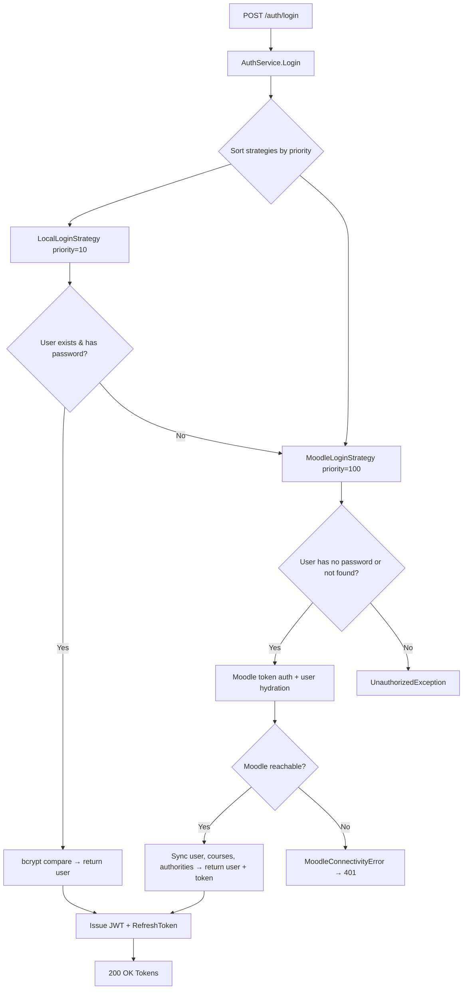
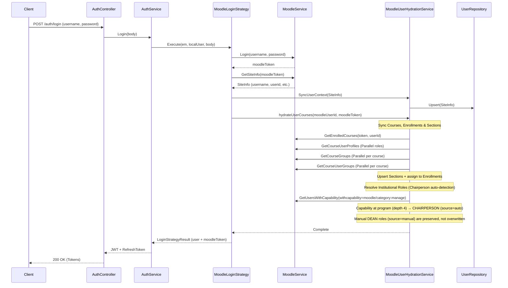

When a user logs in, the `AuthService` resolves the appropriate login strategy based on priority ordering. Strategies are evaluated in order — the first one whose `CanHandle()` returns `true` is executed.

## Login Strategy Resolution



## Moodle Login Flow (Detail)

When the `MoodleLoginStrategy` handles the request, it performs full user hydration:



## Institutional Role Resolution

The system detects institutional management roles from Moodle category capabilities. Roles have a `source` field (`auto` or `manual`) that determines whether hydration can manage them.

### Auto-Detection (CHAIRPERSON)

1. For each enrolled course in a program category (depth 4), check `moodle/category:manage` capability.
2. If the user has the capability, assign `CHAIRPERSON` at that program (`source=auto`).
3. Auto-detected roles are re-evaluated on every login — stale ones are removed.
4. If a manual `DEAN` exists at the parent department, the auto CHAIRPERSON is skipped (DEAN subsumes it).

### Manual Assignment (DEAN)

DEAN roles are assigned by a `SUPER_ADMIN` via `POST /admin/institutional-roles`:

```json
{ "userId": "<uuid>", "role": "DEAN", "moodleCategoryId": 8 }
```

Manual roles (`source=manual`) are never modified by the hydration process. They persist across logins until explicitly removed via `DELETE /admin/institutional-roles`.

### Role Hierarchy

| Depth | Category Level | Role        | Source | Scope                      |
| ----- | -------------- | ----------- | ------ | -------------------------- |
| 3     | Department     | DEAN        | manual | All programs in department |
| 4     | Program        | CHAIRPERSON | auto   | Specific program only      |

### Global Role Propagation

After institutional role resolution, the user's `roles` array is derived from both enrollment roles (via `MoodleRoleMapping`) and institutional roles. A user can have multiple roles (e.g., `[FACULTY, DEAN]` or `[FACULTY, CHAIRPERSON]`).
