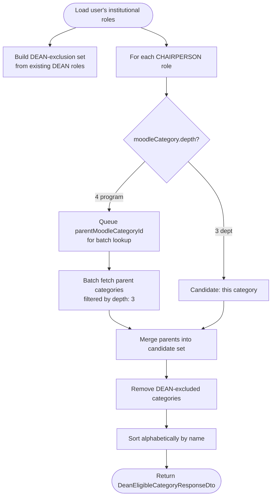

The admin console uses two endpoints to promote a user to `DEAN` without requiring the operator to look up Moodle category IDs by hand. The first lists the categories the target user is eligible to be promoted for; the second performs the actual assignment (existing endpoint, unchanged).

## Dean-Eligible Categories Lookup

`GET /admin/institutional-roles/dean-eligible-categories?userId=<uuid>` — `SUPER_ADMIN` only.

Returns `DeanEligibleCategoryResponseDto[]`, each item shaped `{ moodleCategoryId: number, name: string }`, alphabetized by `name`. Returns `404` if `userId` doesn't resolve to a user.

The algorithm walks the user's existing `UserInstitutionalRole` rows up the Moodle category tree:

**Why this shape.** The admin console previously exposed a raw integer input for `moodleCategoryId`, forcing operators to open Moodle in another tab and look up the right department ID before assigning a DEAN role. The new flow inverts the question: starting from the target user, the server produces exactly the department-level categories the user is _actually_ a chairperson of (either directly, or via a program-to-department walk) and that they're _not yet_ a DEAN of. The admin console renders this as a dropdown.

**Interaction with scope resolution.** The depth-3 / depth-4 walk mirrors the logic in `ScopeResolverService`, but stays read-only and does not use `ResolveDepartmentIds` — the admin promotion path operates on raw Moodle categories (the "canonical" tree) rather than on semester-snapshotted `Department`/`Program` records. See [Scope Resolution — DEAN Depth Auto-Resolution](/docs/architecture/scope-resolution#dean-depth-auto-resolution) for the corresponding rule on the write path.

## Admin User Detail

`GET /admin/users/:id` — `SUPER_ADMIN` only. Path param validated by `ParseUUIDPipe` (`400` on malformed UUID, `404` on missing user).

Returns `AdminUserDetailResponseDto`:

| Field                               | Shape / notes                                                                                                                                       |
| ----------------------------------- | --------------------------------------------------------------------------------------------------------------------------------------------------- |
| Scalars                             | `id`, `userName`, `fullName`, `firstName`, `lastName`, `moodleUserId?`, `userProfilePicture`, `roles[]`, `isActive`, `lastLoginAt`, `createdAt`     |
| `campus` / `department` / `program` | Nullable `{ id, code, name }` via `AdminUserScopedRelationDto` (populated from the user's backfilled scope fields)                                  |
| `enrollments[]`                     | `{ id, role, isActive, course: { id, shortname, fullname } }` — filtered by `isActive: true AND course.isActive: true`, ordered `timeModified DESC` |
| `institutionalRoles[]`              | `{ id, role, source, category: { moodleCategoryId, name, depth } }` — rows whose `moodleCategory` is null are filtered out                          |

Enrollments and institutional roles are loaded in parallel via `Promise.all`. User load populates `['campus', 'department', 'program']` so the scope fields are returned without extra queries.

The admin console pairs this endpoint with the dean-eligibility lookup above to drive the full "inspect user → promote to dean" flow from a single details panel.
