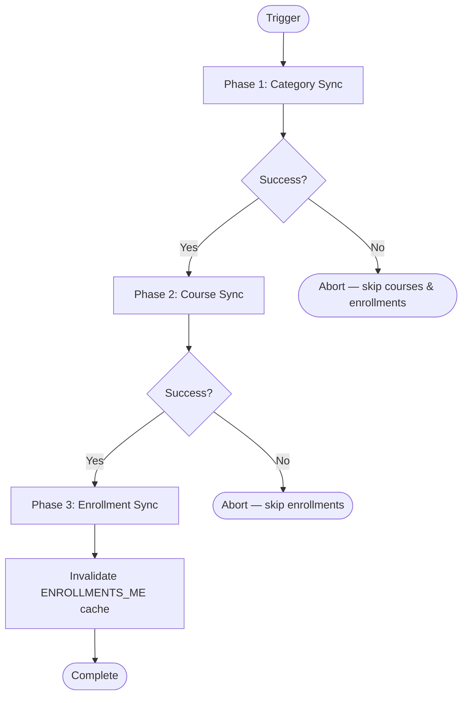

The system synchronizes institutional data (categories, courses, enrollments) from Moodle LMS via a unified BullMQ-based pipeline.

## Trigger Points

| Trigger | Mechanism | Behavior |
| --- | --- | --- |
| **Startup** | `MoodleStartupService` (blocking) | Categories always sync; courses + enrollments gated by `SYNC_ON_STARTUP` |
| **Scheduled cron** | `MoodleSyncScheduler` → BullMQ job | Full sync (categories → courses → enrollments) |
| **Manual** | `POST /moodle/sync` (superadmin) | Same as cron; returns `{ jobId }` or 409 if already running |

### Schedule Resolution

The scheduler uses dynamic cron via `SchedulerRegistry` (no static `@Cron()` decorator). The interval is resolved at startup in priority order:

1. **Database** — `SystemConfig` key `MOODLE_SYNC_INTERVAL_MINUTES` (admin override via `PUT /moodle/sync/schedule`)
2. **Environment variable** — `MOODLE_SYNC_INTERVAL_MINUTES`
3. **Per-environment default** — dev/test: 60 min, staging: 360 min, production: 180 min

Minimum interval is **30 minutes** (enforced at all three layers). The interval is converted to a cron expression internally via `minutesToCron()`.

## Pipeline Flow

### Phase 1: Category Sync

Fetches all Moodle categories and rebuilds the normalized hierarchy (Campus → Semester → Department → Program). Parent entities are cached in in-memory Maps to eliminate N+1 `findOneOrFail` queries.

Can be skipped at startup via `DISABLE_SYNC_CATEGORY_ON_STARTUP=true` for faster dev restarts.

### Phase 2: Course Sync

Syncs courses for all programs concurrently using `pLimit(MOODLE_SYNC_CONCURRENCY)`. Each program's courses are synced in an independent transaction. Failed programs don't abort others.

### Phase 3: Enrollment & Section Sync

Uses a 3-phase architecture to avoid deadlocks from overlapping user rows:

1. **Concurrent HTTP fetch** — `pLimit`-gated parallel calls to Moodle per course (the `core_enrol_get_enrolled_users` response includes a `groups` array per user)
2. **Batch user upsert** — Deduplicated `upsertMany` in a single operation (with individual fallback)
3. **Sequential per-course enrollment upsert** — For each course:
   - Extracts unique groups from the enrolled users' `groups` data and upserts `Section` entities
   - Upserts enrollments with the resolved `section` FK (first group the student belongs to)
   - Soft-deactivates missing enrollments

No additional Moodle API calls are needed for sections — group data is already returned by the enrolled users endpoint.

## Observability — SyncLog

Every sync execution (scheduled, manual, startup) creates a `SyncLog` record in the database. The processor creates it at job start (`status: running`) and updates it after each phase and on completion.

Each phase stores a `SyncPhaseResult` (JSONB) with:

| Field | Description |
| --- | --- |
| `status` | `success`, `failed`, or `skipped` |
| `durationMs` | Wall-clock time for the phase |
| `fetched` | Remote records received from Moodle |
| `inserted` | New records created (count-before/after strategy) |
| `updated` | Existing records updated via upsert |
| `deactivated` | Records soft-deactivated (missing from remote) |
| `errors` | Per-item error count within the phase |

Overall sync status: `completed` (all phases succeeded), `partial` (some failed/skipped), or `failed` (all failed).

Manual syncs record `triggeredBy` (FK to User) via CLS (`CurrentUserService`).

The `SyncLog` entity does **not** extend `CustomBaseEntity` — audit records are never soft-deleted. Queries must use `filters: { softDelete: false }` to bypass the global MikroORM filter.

## Endpoints

| Method | Path | Auth | Description |
| --- | --- | --- | --- |
| POST | `/moodle/sync` | SUPER_ADMIN | Trigger sync (409 if already running) |
| GET | `/moodle/sync/status` | SUPER_ADMIN | Queue state: `idle`, `active`, or `queued` |
| GET | `/moodle/sync/history` | SUPER_ADMIN | Paginated sync log history with per-phase metrics |
| GET | `/moodle/sync/schedule` | SUPER_ADMIN | Current interval (minutes), resolved cron, next execution |
| PUT | `/moodle/sync/schedule` | SUPER_ADMIN | Update interval in minutes (min 30), persists to DB |

## Deduplication

- **Cron**: Fixed `jobId` (`moodle-sync-scheduled`) — BullMQ silently ignores duplicate waiting jobs
- **Manual**: 409 guard checks `activeCount + waitingCount > 0` before enqueuing
- **Processor**: `concurrency: 1` ensures at most one sync runs at a time

## Environment Variables

| Variable | Default | Purpose |
| --- | --- | --- |
| `SYNC_ON_STARTUP` | `false` | Enable course + enrollment sync at boot |
| `DISABLE_SYNC_CATEGORY_ON_STARTUP` | `false` | Skip category sync at boot (dev only) |
| `MOODLE_SYNC_CONCURRENCY` | `3` | Max concurrent Moodle HTTP calls (1-20) |
| `MOODLE_SYNC_INTERVAL_MINUTES` | — | Override sync interval (min 30); per-env default used if unset |
